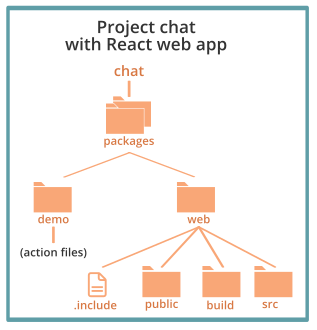

# How To Use the Nimbella Platform
<main>
This document provides information about the Nimbella Command Line Tool, called nim, and its Command Line Interface (CLI). There are also several [Nimbella demo projects at GitHub](https://github.com/nimbella/demo-projects) that you can try out.

---

## Your Nimbella cloud account

Your Nimbella cloud account gives you the following benefits:

*   A dedicated and secure domain name for your cloud applications. If you need more, let us know.
*   Static front-end assets are automatically deployed to and served from a global CDN.
*   Back-ends you can run on demand, near-instantly. No servers for you to manage.
*   A secured data bucket to upload files. Limit access as needed.
*   Application state recorded in a [Redis key-value store](https://redis.io), with data accessible to all your back-end logic at extremely low latency.
*   Workflows you can  build and the ability to orchestrate long-running tasks.
*   CLI and workbench tools to manage Nimbella services, build projects, and deploy your apps.

Once you [create your first Nimbella Cloud namespace](#create-a-nimbella-namespace) you are ready to login and [run CLI commands](#nim-command-overview) and deploy projects to your Nimbella Cloud.

---


## Install the Nimbella Command Line Tool (nim)

In most cases, we recommend that you use nim as a command to be invoked globally from shells or scripts. Here are the advantages of shell invocation:

*   The CLI is self-contained and has no dependencies on previously installed software.
*   You get automated update services when new versions are available.

If you don’t want a global installation but rather want to make nim a dependency of some other package, you can install it as a dependency with npm or yarn. See the second procedure.

### Install nim globally

1. Install nim according to your operating system:
   *   On Windows, download and run [the Windows installer](https://apigcp.nimbella.io/downloads/nim/win/nim-x64.exe).
   *   On Mac, download and run [the Mac installer](https://apigcp.nimbella.io/downloads/nim/macos/nim.pkg).
   *   On Linux, run the following script:
       `curl https://apigcp.nimbella.io/downloads/nim/nim-install-linux.sh | sudo bash`
2. When the installation completes, run the following command: `nim update`

The `nim update` command verifies that nim is installed and capable of self-updating. If the initial installation happens not to be the latest version, the update step also corrects that.

### Install nim as a dependency

Use this method only to make nim a dependency of some other package. To invoke nim globally, use the previous procedure.

**Note:** When installed as a dependency, the `nim update` command will not work. You have to do a fresh install to get later versions.

1. Run either of the following commands, depending on whether you want to use npm or yarn:
  *   For npm: `npm install https://apigcp.nimbella.io/downloads/nim/nimbella-cli.tgz`
  *   For yarn: `yarn add https://apigcp.nimbella.io/downloads/nim/nimbella-cli.tgz`

2. When installation finishes, execute nim locally to the package into which it has been incorporated with the following command. For example using `npx nim ...`

---


## nim command overview

The Nimbella Command Line Tool (nim) is your primary portal to Nimbella services. Typing `nim` at a command prompt produces the latest version of help output, similar to the following.

```
> nim
A comprehensive CLI for the Nimbella stack

VERSION
  nimbella-cli/0.1.15 darwin-x64 node-v13.12.0

USAGE
  $ nim [COMMAND]

COMMANDS
  action      work with actions
  activation  work with activations
  auth        manage Nimbella and Github credentials
  doc         display the full documentation of this CLI
  help        display help for nim
  info        show information about this version of 'nim'
  key-value   work with key-value store
  namespace   work with namespaces
  objects     work with objects store
  package     work with packages
  project     manage and deploy Nimbella projects
  route       work with routes
  rule        work with rules
  trigger     work with triggers
  update      update the nim CLI
  web         work with web contents
  workbench   open Nimbella workbench with login or command
```

These commands fall into four categories, described in the following sections.

**Note:** In some of the help output from `nim` (as shown) there are colon separators between parts of the command.  This happens because nim is based on [oclif](https://github.com/oclif), the Open CLI Framework from Heroku, which requires them. However, nim has logic to allow blank separators, so you can also use these commands with blank separators, as in these examples:

```
> nim auth list
> nim project deploy
```

If you find a case in which a blank separator doesn't work in nim, please [report it as an issue](https://github.com/nimbella/nimbella-cli/issues) or use a colon separator.


### 1 Credential management to access Nimbella namespaces

The `auth` subtree lets you manage Nimbella credentials for Nimbella _namespaces_, as described in the section [Nimbella Namespaces](#nimbella-namespaces).

The `nim auth` subtree has its own set of commands, as follows.

```
> nim auth
manage Nimbella and Github credentials

USAGE
  $ nim auth:COMMAND

COMMANDS
  auth:current  Get current namespace with optional details
  auth:export   Make a token for switching to another machine or web browser
  auth:github   manage github accounts
  auth:list     List all your Nimbella namespaces
  auth:login    Gain access to a Nimbella namespace
  auth:logout   Drop access to a Nimbella namespace
  auth:switch   Switch to a different Nimbella namespace
```


### 2 Project-level deployment commands

The `nim project` subtree has three commands:

*   `create`
*   `deploy`
*   `watch`

These subcommands operate on logical groupings of resources (web content, storage, and APIs) that make up typical applications. Such a grouping is called a _project_ and is described more in [About Nimbella Projects](#overview-of-nimbella-projects-actions-and-deployment).

The `project:deploy` command controls the Nimbella _deployer_, which operates on projects. Much of the rest of this document concerns itself with projects and the deployer.

Help output for the `nim project` command:

```
> nim project
manage and deploy Nimbella projects

USAGE
  $ nim project:COMMAND

COMMANDS
  project:create  Create a Nimbella Project
  project:deploy  Deploy Nimbella projects
  project:watch   Watch Nimbella projects, deploying incrementally on change
```

Help output for the `nim project create` command:

```
> nim project create
Create a Nimbella Project

USAGE
  $ nim project:create [PROJECT]

ARGUMENTS
  PROJECT  project path in the file system

OPTIONS
  -c, --clientCode                           Generates client code
  -i, --id=id                                API specs id/name/path
  -k, --key=key                              Key to access the source API
  -l, --language=go|js|ts|py|java|swift|php  [default: js] Language for the project (creates sample project unless source is specified)
  -o, --overwrite                            Overwrites the existing nimbella project directory if it exists
  -s, --source=postman|openapi               API specs source
  -u, --updateSource                         Sync updated API specs back to source
  -v, --verbose                              Greater detail in error messages
  --config                                   Generate template config file
  --help                                     Show help
```

See the [Example: Create and deploy a project with a single action](#example-create-and-deploy-a-project-with-a-single-action) for an example of using the project create command.

Help output for the `nim project deploy` command:

```
> nim project deploy
Deploy Nimbella projects

USAGE
  $ nim project:deploy [PROJECTS]

ARGUMENTS
  PROJECTS  one or more paths to projects

OPTIONS
  -v, --verbose          Greater detail in error messages
  --apihost=apihost      API host to use
  --auth=auth            OpenWhisk auth token to use
  --env=env              path to environment file
  --exclude=exclude      project portions to exclude
  --help                 Show help
  --include=include      project portions to include
  --incremental          Deploy only changes since last deploy
  --insecure             Ignore SSL Certificates
  --target=target        the target namespace
  --verbose-build        Display build details
  --verbose-zip          Display start/end of zipping phase for each action
  --web-local=web-local  a local directory to receive web deploy, instead of uploading
  --yarn                 Use yarn instead of npm for node builds

```

See the [Example: Create and deploy a project with a single action](#example-create-and-deploy-a-project-with-a-single-action) for an example of using the project deploy command.

Help output for the `nim project watch` command:

```
> nim project watch
Watch Nimbella projects, deploying incrementally on change

USAGE
  $ nim project:watch [PROJECTS]

ARGUMENTS
  PROJECTS  one or more paths to projects

OPTIONS
  -v, --verbose          Greater detail in error messages
  --apihost=apihost      API host to use
  --auth=auth            OpenWhisk auth token to use
  --env=env              path to environment file
  --exclude=exclude      project portions to exclude
  --help                 Show help
  --include=include      project portions to include
  --insecure             Ignore SSL Certificates
  --target=target        the target namespace
  --verbose-build        Display build details
  --verbose-zip          Display start/end of zipping phase for each action
  --web-local=web-local  a local directory to receive web deploy, instead of uploading
  --yarn                 Use yarn instead of npm for node builds
```

See [Project watching](#project-watching-for-incremental-deployment) for an example of how to use this command for incremental deployment which facilitates faster project development.

### 3 Entity management commands

The `action`, `activation`, `key-value`, `namespace`, `objects`, `package`, `route`, `rule`, `trigger`, and `web` commands each manage the corresponding type of entity in your namespace.

If you’re an [Apache OpenWhisk](https://openwhisk.apache.org) developer, see [Entity Management commands in nim vs. wsk](#entity-management-commands-in-nim-vs.-wsk) for a comparison of entity management commands.


### 4 Supporting commands

The `doc`, `help`, `info`, `update`, and `workbench` commands provide the following supporting services:

*   `doc`: Displays the documentation set for the nim CLI.
*   `help`: Displays help for nim.
*   `info`: Displays information about the version of nim that is installed.
*   `update`: Updates to the latest version of nim.
*   `workbench`: Manages the Nimbella Workbench for you.

The Nimbella Workbench is described in [The Nimbella Workbench](#the-nimbella-workbench)

**Note:** `nim update` works only when nim is installed [using the recommended installation method for use from a shell](#install-nim-for-shell-invocation-globally). It does not work when nim is installed [as a dependency using npm or yarn](#install-nim-as-a-dependency).

---

## The Nimbella workbench

Many (though not all) `nim` commands will also run in your web browser, which wraps some graphical assistance around `nim` and provides some additional commands.  This separate but closely related tool is called the Nimbella Workbench.

If you've never used the workbench (and assuming you are logged into a Nimbella account) you should enable the same Nimbella account on the workbench by opening it from the command line, as follows.

```
nim workbench login
```

This will open the workbench in your default browser and log you in there with the same Nimbella namespace credentials you are using locally (see [Nimbella Namespaces](#nimbella-namespaces)).  Those credentials will be remembered for that browser on the current machine.  You can bookmark the workbench, or you can run it again with a particular command, as in the two following examples.

```
nim workbench run
nim workbench run action list
```

Once you are in the workbench, all `nim` subcommands are available except for these few.

```
action create
action update
object create
object get
project create
project watch
web create
web get
workbench login
workbench run
```

Those few commands are either inappropriate for the workbench or require filesystem access, which is unavailable in a browser.

When running in the workbench, the `project deploy` command can only deploy from GitHub, not from the local file system.  It also cannot deploy projects that require building (forking a process and using the local file system).  A remote building option is planned for the future.

The prefix `nim` is optional in front of workbench commands.

To transfer your credentials to the workbench running in a browser that is not the default browser, just visit the workbench there and type `auth login`.  You will need to provide some of the information you provided when you opened your Nimbella account but a duplicate account will not be created.  You will be connected to your existing account.

## Nimbella namespaces

You must have permission to use a specific namespace on the Nimbella platform In order to deploy a nim project and use many other nim capabilities.  A Nimbella namespace comes with storage resources which are managed as part of the namespace.

This section contains information about how to create a Nimbella namespace, view the credential store, and perform other tasks involving namespaces.


### Create a Nimbella namespace

Here’s how to create a Nimbella workspace in `nim`.

**If you have not yet downloaded and installed the Nimbella Command Line Tool:**

Visit [nimbella.com](https://nimbella.com) and press the signup button (it's free).  Follow instructions from that point.

**If you have already downloaded and installed the Nimbella Command Line Tool:**

Issue

```
> nim auth login
```

After going through the signup process (which typically takes one or two minutes), `nim` will return having fully provisioned your account.  Occasionally, if the process takes too long, `nim` may time out and encourage you to do another `nim auth login` in a minute or two.  The second attempt should succeed quickly.

In general (e.g.) when switching to a different machine you can just issue

```
> nim auth login
```

This will connect the tool to your account (it may or may not ask for identification again, depending on whether or not your browser remembers this information).

### View the credential store

A typical namespace is provisioned with the following:

*   A web content area and an object storage area.  These are always provided as a pair and summarized as 'Storage' when presented in a list.
*   A [Redis](https://redis.io) instance for storing key-value pairs
*   A DNS domain name for web content
*   A set of OpenWhisk resources

After you’ve created a namespace, you can view it and information about it in the _credential store_.

**To view the credential store in nim:**

*   Use the `auth list` command, as follows:

```
> nim auth list
  Namespace            Current Storage   Redis Production Project
✓ <your namespace>       yes     yes      yes     no      <any>
```

As a new user, your credential store has only one entry, but, if you or your team acquires more namespaces, there can be multiple entries.
Here’s more information about the table displayed in the response:

*   The **Current** column displays `yes` for exactly one namespace.
    - The Nimbella deployer will deploy this namespace in the absence of other directives.
    - This entry is also marked by a check mark for added emphasis
*   The **Storage** column indicates whether the namespace has provision for web content storage as discussed in [Adding static web content](#adding-static-web-content). There is also a second object storage bucket available for general use, not connected to the web.
*   The **Redis** column indicates whether the namespace has a Redis key-value storage instance available for use by actions.
*   The **Production** and **Project** columns become meaningful as you begin to define Nimbella [projects](#about-projects) and wish to [tie namespaces to projects](#tieing-namespaces-to-projects).

### Create and manage multiple namespaces

There are a number of reasons why it can be useful to have multiple namespaces. For example, while multiple applications can share a namespace, there are also good reasons to isolate them.

**To create additional namespaces:**

1.  [Contact Nimbella Support](https://nimbella.com/contact).
2.  Identify yourself as an existing developer and provide the email or github account you used for signing up initially.
3.  Wait for an email to arrive containing instructions for adding the additional namespace to your credential store.

**To view all of your namespaces:**

Follow the procedure to [view your credential store](#view-the-credential-store).
A newly added namespace is automatically set as current, indicated by a checkmark and a **yes** in the **Current** column.

#### Switch between namespaces

If you have more than one namespace, you can switch between them without needing to log into your account again by using the following command:

```
nim auth switch <namespace>
```

This changes the target namespace for future project deployments.  Most namespace names are long and tedious to type, so we provide an abbreviation capability.

```
nim auth switch dt-
```

will switch to a namespace uniquely identified by the characters `dt` followed by other characters.

#### Manage multiple namespaces

The easiest way to manage multiple namespaces is to maintain the rule that each namespace is tied to a project and each project is tied to one or two namespaces. To do this, add the following top-level directive to a _project.yml_ configuration file for each project:

```
targetNamespace: <namespace>
```

or

```
targetNamespace:
  test: <namespace1>
  production: <namespace2>
```

A more complete explanation of how `targetNamespace` affects project deployment is provided in [Tieing namespaces to projects](#tieing-namespaces-to-projects).

There are more complex development scenarios, in which you would not want to correlate projects and namespaces so strongly.  For those cases, we also provide the `--target` directive of the `project deploy` command:

```
nim project deploy <projectPath>... --target <namespace>
```

**Notes:**

*   If your project has a _project.yml_ configuration file with a `targetNamespace` directive and also uses the `--target` option in a `project deploy` command, the latter takes precedence.

*   For more information about using _project.yml_ files to configure more complex projects, see [Adding Project Configuration](#adding-project-configuration).

---


## Overview of Nimbella projects, actions, and deployment

A Nimbella _project_ is a logical grouping of static web content and _actions_. An action is a function or program written in a programming language supported by the Nimbella Cloud (e.g., JavaScript, TypeScript, PHP, Python, Java,  Go, or Swift). An action usually produces some output in response to an event. For example, an action can be used to convert an image to text, update a stock portfolio, or generate a QR code. Actions are usually grouped into _packages_, but you can create them without a package qualifier if you wish.

Projects are _deployed_ as a unit into your Nimbella Cloud namespace to make them visible to your end-users to the extent that you wish. Your namespace can have any number of projects that you want. An application can have any number of projects to achieve its full functionality. This modular approach also lets you share projects across apps and namespaces.

On the other hand, `nim` provides some special support for the model where namespaces are tied to specific projects, which have the sole right to deploy to them.  It is possible to tie two namespaces to each project, one for testing, one for production.  The support for this model is described in [tieing namespaces to projects](#tieing-namespaces-to-projects).

Projects can contain actions, or actions plus static web content, or actions plus web content plus build steps. The following sections show you how to go from simple to complex:

*   [Example: Create and deploy a project with a single action](#example-create-and-deploy-a-project-with-a-single-action)
*   [Add static web content](#adding-static-web-content) to a project
*   [Add build steps](#incorporating-build-steps-for-actions-and-web-content) to a project

Projects can be deployed without any configuration, but in more complex cases you can
[add a project configuration](#adding-project-configuration).

Finally, there are variations in how to [deploy projects](#about-projects), including [incremental deployment](#deploying-projects-incrementally) to reduce deployment time, especially during project development.

---


## Example: Create and deploy a project with a single action

Let’s start with a really simple example that shows the basics of creating the source code for an action, placing it in a directory structure for a project, and deploying the project. This project needs no configuration and creates actions automatically based on the project directory structure.

In the simplest implementation of a project, each action corresponds to a single source file. In this example:

*   A `Hello World` print function is placed in a file named _hello.js_.
*   A project named `example1` is created and deployed to your namespace.

**To create and deploy a project to print Hello World (simplest form):**

```
> nim project create example1
> nim project deploy example1
Deploying project '/path/to/example1'
  to namespace '...'
  on host 'https://...nimbella.io'
Deployment status recorded in 'example1/.nimbella'

Deployed actions:
  - hello
> nim action invoke hello
{
  "greeting": "Hello stranger!"
}
```
So, what just happened?  As a result, of `nim project create`, `nim` generated a project and added a sample to it called `hello.js`.  Specifically, in your current directory, it created

```
example1/packages/default/hello.js
example1/web
```

We address the purpose of the `web` directory in [Adding static web content](#adding-static-web-content) and the `packages` directory later in this section.

As a result of `nim project deploy`, the project was deployed to your namespace and the result was an action called `hello`.  To record the status of that deployment, `nim` created

```
example1/.nimbella/...
```

The `nim action invoke` step invoked the just-deployed action.

THe `nim project create` command has some other features that will come up in other examples.  But, `nim project create` is only a convenience.

To make the process less magical and more hands-on, remove the entire `example1` from your local filesystem and let's start over, without using `nim project create`, emphasizing that a Nimbella project, no matter how it is created and modified, is just an area in your local file system.

**Create and deploy a project to print Hello World (more manually):**

(1) Create _hello.js_ with the following code:

```nodejs
function main(args) { return { msg: 'Hello World' } }
```

(2) Create a project directory with the following command:

```
> mkdir -p example1/packages/demo
```

The [project directory structure](#about-projects) sets the name of the project (`example1`), a _packages_ directory, and the package qualifier (`demo`).  There is no `web` directory this time; `web` is not required if you aren't adding web content.

(3) Copy the JavaScript file into the `demo` directory with the following command.

```
> cp hello.js example1/packages/demo
```

(4) Deploy the project.

```
> nim project deploy example1
Deploying project '/path/to/example1'
  to namespace '...'
  on host 'https://...nimbella.io'

Deployed actions:
  - demo/hello
```

(5)  Invoke the deployed action.

```
> nim action invoke demo/hello
{
  "msg": "Hello World"
}
```

Here’s a diagram of the project structure that was created in this procedure.

<center id="fig2"></center>
<center>**Figure 1: Directory structure of the example1 project**</center>

**Notes:**

*   The `project deploy` command activates the deployer, which names the action automatically based on the source code file (`hello`), prepended by the package qualifier (`demo`).
*   If you want an action to have a simple name (no package qualification), put it in a package directory called _default_. In that case, no package qualifier is prepended. See [Project Directory Structure](#project-directory-structure).  When `nim` generates a sample in `nim project create` it uses this feature.
*   The correct runtime for the source code file is determined according to the file suffix.  The command `nim info --runtimes` will list the supported runtimes.  At this time, the list does not include file suffixes.  See [Nimbella Deployer Supported Runtimes for Actions](#nimbella-deployer-supported-runtimes-for-actions) for a list that includes suffixes.
*   Project configuration occurs automatically when it can, but see [Adding Project Configuration](#adding-project-configuration) for complex projects.

**Next steps:**

*   To add web content to your project, see [Adding static web content](#adding-static-web-content).
*   If you need to add build steps, see [Incorporating build steps for actions and web content](#incorporating-build-steps-for-actions-and-web-content).
*   Read more about [deploying projects](#about-the-nimbella-deployer).
*   Look at a somewhat more complex [example QR code project with both an action and static web content](https://github.com/nimbella/demo-projects/tree/master/qrcode).

---


## About projects

A project represents a logical unit of functionality whose boundaries are up to you. Your app can contain one or more projects. The directory structure of a project triggers how the deployer finds and labels packages and actions, how it deploys static web content, and what it ignores. In more complex cases you can set more control over project deployment by adding a [project configuration](#adding-project-configuration).


### Project directory structure

A project has a fixed directory structure, which determines how projects are deployed. Here’s a diagram that summarizes the directory structure of an individual project with no project configuration, with explanation below.

<center></center>
<center>**Figure 2: Basic directory structure of a project**</b></center>

The project has a root directory, within which a certain small number of directory names are significant to the deployer, specifically:

*   A _packages_ directory. Each subdirectory of _packages_ is treated as a package and is assumed to contain actions, in the form of either files or directories. Files in the _packages_ directory are ignored by the deployer.
*   A _web_ directory, which contains directories and files with static web content.

Anything else in the root directory is ignored by the deployer, shown in blue in the diagram. This lets you store things in the root directory that need to be “off to the side,” such as build directories used by the deployer and project documentation.


### Projects with multiple actions

Adding more actions to a project is easy when each action is related to a single source code file. You can create as many subdirectories of the packages directory as you want and add as many source code files as you want to each subdirectory. (See [Project Directory Structure](#about-projects).)

### Factors in choosing project size

There is no limit on how many packages and actions can be in a project.  However, using fewer very large projects or many small projects both have some negative ramifications, which are solved by using [incremental deployment](#deploying-projects-incrementally).

For example, you could create one large project. However, the default behavior of the deployer is to deploy everything in the project that it can, so deployment could become time-consuming.

The other extreme is to create many small projects. You can use the `project deploy` command with a list of projects in a single invocation to deploy them all at once (e.g., `nim project deploy example1 example2 …`). Having lots of small projects may lengthen the build process, especially during iterative development.

Incremental deployment facilitates deployment of both large and small projects, so you can create projects that make sense logically.


### Factors in choosing project boundaries

Projects and actions are very flexible.

*   When deploying a project, all of its actions and web resources are installed into a single target namespace.
*   Multiple projects can deploy into the same namespace.
*   The actions within a project can span multiple packages and a given package can have actions contributed by multiple projects.

In other words, _you_ decide on project boundaries based on deployment convenience.

**Note:** As a consequence of this flexibility, it’s important to watch for possible collisions between different projects trying to install the same resource. There are some audit trails that can help, described in [Deployer recordkeeping](#deployer-recordkeeping).

---


## About actions

### Actions Have Public URLs by Default Unless the Project is Configured

Every action produced by a no-configuration project such as [the example project above](#example-create-and-deploy-a-project-with-a-single-action) is publicly accessible via a URL and is called a _web action_. You can retrieve the URL for any particular web action by using the `action get` command, as in the following example, which returns the URL for the `demo/hello` action created in the previous example.

```
> nim action get demo/hello --url
https://....nimbella.io/api/v1/web/.../demo/hello
```

If you don’t want your actions to be publicly accessible through an unprotected URL, you’ll need to [add a project configuration](#adding-project-configuration).


### Using zipped source files to form a single action

If you have more than one source file that must be bundled together to create a single action, you can zip the source files together as long as the file name and suffix take the following form _\<xxx\>.\<runtime\>.zip_.

The deployer normally [determines the runtime for the source file from the file’s suffix](#nimbella-deployer-supported-runtimes-for-actions), and the _.zip_ suffix doesn’t provide this information, so the runtime must be specified between the file name and the file suffix, demarcated by periods. For example, the name _hello.nodejs.zip_ can be used for a zipped action whose action name is `hello` and whose runtime kind is the default version of Node.js.

If you want to force a specific runtime version, use a file of this form instead: _hello.nodejs-8.zip_. The Nimbella Cloud must support the version you specify.

Some language runtimes, such as Java, also accept specialized archives such as _.jar_ files, or they directly accept binary executables. In this case, the runtime is determined by the file extension in the normal manner, such as _hello.jar_. Other cases are not specially handled by nim and might require [adding a project configuration](#adding-project-configuration).

Zipped actions are usually created in a separate build step. As an alternative, Nimbella has [an autozip feature triggered by directory structure](#multifile-actions-created-with-autozip).


### Multifile actions created with autozip

By creating a directory under the package directory, named for the action, and containing its source file(s), you can expand to multiple source files and they will be zipped automatically. Certain conditions must be met for this to work. Suppose the [example1 project](#example-create-and-deploy-a-project-with-a-single-action) has a `hello` action with two source files: _helloMain.js_ and _helloAux.js_. To create the `demo/hello` action, add a `hello` directory as a child of the `demo` directory, as shown in this diagram.

<center></center>
<center>**Figure 3: Two source files in an action directory for automatic zipping**</center>

The difference from the [example1 directory structure](#fig2) is that the `hello` action is a _directory_ rather than a single source file. The source files in the directory are zipped automatically to form the action.

For autozipping to work in a project with no configuration, the following conditions must be met:

*   At least one source file must have [a suffix from which the runtime type can be inferred](#nimbella-deployer-supported-runtimes-for-actions).
*   No other source file can have a suffix implying a different runtime.
*   All source files must be compatible with the chosen runtime.
*   Exactly one file must contain an identifiable `main` entry point, as required by the particular runtime selected.

These conditions can be relaxed by using [project configuration](#adding-project-configuration).

Subdirectories can be present under an action directory (for example, a `node_modules` directory as in the following diagram). These directories are zipped up with everything else under the action directory.

<center></center>
<center>**Figure 4: Autozipping a subdirectory of an action directory**</center>

You can optionally limit the files to be zipped in either of two ways:

*   Add a file called `.include`, which lists exactly the items to be included. Anything else in the action directory is excluded. Wildcards are not permitted in this file but entries can denote directories as well as files. The `.include` file can also be used for linking to somewhere else in the filesystem, as described in [Using an action source from elsewhere in the filesystem](#using-an-action-source-file-from-elsewhere-in-the-filesystem).
*   Add a file called `.ignore`, stating which files and directories _not_ to include. The `.ignore` file follows the same rules as `.gitignore` and has the same effect. It is not necessary to list `.ignore` inside itself. It is automatically ignored, as are certain build-related files.

You cannot have both a `.include` and `.ignore` in the same action directory.

**Note:** No zipping occurs in any of the following cases:

*   The directory representing the action contains only a single file.
*   Only one file is listed in `.include`.
*   Only one file is left after applying the rules in `.ignore`.


#### Using an action source file from elsewhere in the filesystem

If you use an `.include` file, it can contain entries that denote files or directories outside the action directory. Entries can be either absolute paths or paths that are relative to the action directory using standard `../` notation.

**Note:** Although paths in `.include` can terminate outside the project, it becomes harder to relocate the project. It’s better practice to include files within the project. If they are directories that you want the deployer to ignore, you can put them in the root directory, as described in [About projects](#about-projects).

Entries in `.include` are interpreted differently if they are absolute or relative. If the path is relative, the resulting entries in the zip file start with the last segment of the listed path. Here are two examples:

*   If you have `../../../lib/node_modules`, the contents of the node_modules directory are zipped but files inside the directory have the form `node_modules/<path>`.
*   If you have `../../../lib/helpers.js` the file becomes just `helpers.js`.

---


## Adding static web content

To add static web content to a project, add a directory called _web_ as a peer of the directory called _packages_. This directory should contain files whose suffixes imply well-known mime types for web content, such as _.html_, _.css_, or _.js_.

**Note:** JavaScript files in static web content are _not_ actions but are scripts intended to run in the browser.

The _web_ directory can have subdirectories and can be built by website builders or other tools.

Like an action directory, the _web_ directory may contain `.include` or `.ignore` to control what is actually considered web content, as opposed to build support or intermediate results. For more information about `.include` and `.ignore`, see [Multifile actions created with autozip](#multifile-actions-created-with-autozip).

The _web_ directory also supports integrated [building](#incorporating-build-steps-for-actions-and-web-content), just like an action directory.

Here’s an example of a project with modest web content, populated by hand. For simplicity, the actions of the project are not shown.

```
example3/web/chatroom.html
example3/web/chatroom.css
example3/web/runner.js
example3/web/favicon.ico
```

Here’s a diagram of the `example3` project structure.

<center></center>
<center>**Figure 5: A project with static web content**</center>

Here’s the output when the project is deployed.

```
> nim project deploy example3
Deploying project '/path/to/example3'
  to namespace '...'
  on host 'https://...nimbella.io'

Deployed 4 web content items to
  https://<namespace>-host.nimbella.io
Deployed actions:
  ...
```

As the output shows, the contents of the web directory were deployed to the web, with URLs within your namespace’s unique DNS domain `<namespace>-host.nimbella.io`, where `<namespace>` is your namespace. The remaining portion of the domain name may differ depending your account configuration and your API host within the Nimbella Cloud. To access the content, either `http` or `https` may be used. For `https`, the SSL certificate will be that of Nimbella Corp.

**Notes:**

*   For a web deployment to work correctly, the namespace entry in the credential store must include storage. See [View the Credential Store](#view-the-credential-store) to generate the credential store, then check to make sure the `Storage` column of the response says `yes`. The first namespace created for each user includes storage, but it’s possible to create namespaces without it.
*   You can add [project configuration to change how your static web content is deployed](#project-configuration-for-web-content).
See [an example of how to configure a project when you generate web content with a tool such as React.](#configuration-example-for-web-content-generated-by-a-tool)

---


## About the Nimbella deployer


### Nimbella deployer supported runtimes for actions


The Nimbella deployer determines the kind of runtime required for the action from the file suffix. The following runtimes are supported:

*   Node.js for suffix _.js_
*   Typescript for suffix _.ts_
*   Python for suffix _.py_
*   Java for suffixes _.java_ and _.jar_
*   Swift suffix _.swift_
*   PHP for suffix _.php_
*   Go for suffix _.go_

### Deploying projects incrementally

Instead of deploying your entire project each time you make a change to the file contents, you can use incremental deployment to detect and deploy changes in the following:

*   Project structure
*   Project content
*   [Project configuration](#adding-project-configuration) (if you have created one)

This is a great time-saver during project development and also helps [facilitate deployment when your project is large](#factors-in-choosing-project-size).

Consider the following example of an `example4` project. The output from standard deployment is shown here:


```
> nim project deploy example4
Deploying project '/path/to/example4'
  to namespace '...'
  on host 'https://...nimbella.io'
Deployed actions:
  - admin/adduser
  - welcome
  - demo/hello
```

Now suppose that you’ve made changes to `demo/hello` and `welcome` but not the others. You aren’t ready to do a production deployment or submit for testing, you just want to deploy what’s changed so you can continue developing.

To deploy incrementally, use the `--incremental` flag, as in the following example.


```
> nim project deploy example4 --incremental
Deploying project '/path/to/example4'
  to namespace '...'
  on host 'https://...nimbella.io'
Deployed actions:
  - welcome
  - demo/hello
Skipped 1 unchanged action
```

Changes to actions and web content are tracked by means of digests created by the deployer and described in more detail in [Deployer recordkeeping](#deployer-recordkeeping). The deployer skips the uploads of actions and web content whose digests have not changed. Digests are computed over an action’s contents and also its metadata, so if you use a [project configuration](#adding-project-configuration) file to change the properties of an action, those changes are detected as well.

The `--incremental` option also skips rezipping large multi-file actions whose included contents are older than the last zip file.

The `--incremental` option is accurate in determining what has changed unless you add build steps. After you add build steps, some heuristics come into play, as discussed in [Build States and the Effect of --incremental on Builds](#build-states-and-the-effect-of-incremental-on-builds).


#### Project watching for incremental deployment

A good way to implement incremental deployment during project development is to use `nim project watch`. The `project watch` command typically runs until interrupted in a devoted terminal window so you can work elsewhere, such as in your favorite IDE.

Here’s an example of using this command for incremental deployment.

```
> nim project watch example4
Watching 'example4' [use Control-C to terminate]
...
Deploying 'example4' due to change in 'path/to/packages/demo/hello'

Skipped 4 unchanged web resources on
  https://<namespace>-host.nimbella.io
Deployed actions:
  - demo/hello
Deployment complete.  Resuming watch.
```

The `project watch` command accepts a list of projects and most of the flags that project `deploy` accepts, as described in [Project-Level Deployment Commands](#project-level-deployment-commands). An exception is `--incremental`, which is assumed.

### Deploying Portions of Projects Selectively

There may be occasions when you only want to deploy parts of a project.  If the change-based selection of incremental deployment does not fit your needs, you can control which actions are deployed (and whether web content is deployed) directly from the command line.

```
# Deploy just the web content and no packages
nim project deploy printer --include web

# Deploy everything except the admin package
nim project deploy printer --exclude admin

# You can use --include and --exclude together
nim project deploy printer --include admin,printer --exclude printer/notify
```

The general rule for both `--include` and `--exclude` is a comma-separated list of tokens (no whitespace).  The tokens may be

- the special word `web` referring to the web content of the project
- the name of a package
  - if the package is called `web`, you should remove ambiguity by using a trailing slash as in `web/` (a trailing slash is accepted on any package)
  - the package name `default` is used for the actions that are not members of any package
- a qualified action name in the form `package-name/action-name`
  -  e.g. `printer/notify` or `default/hello`
  -  the `default/` prefix is required for actions not in any package; otherwise, the name will be taken to be a package name
- wildcards are _not_ supported

If you specify only `--include`, then only the listed project portions are deployed.  If you specify only `--exclude`, then _all but_ the listed project portions are deployed.  If you specify both flags, the deployer first includes only what is listed in `--include` and then excludes from that list.  This allows you to include a package while excluding one or more of its actions.

### Deploying Directly from Github

If you have Nimbella projects in a Github repository, you can deploy directly from github without the need to create a local clone.  If you do have a local clone, you can deploy as needed from the clone or directly from Github.  For example, deploy from the clone to include your local modifications.  Deploy from Github to ignore your local modifications and restore the deployed code to what is in the remote repository.

The `nim` command does not get involved in keeping your clone in synch with the repository; that is up to you as a developer.

To indicate you want to deploy from github, use a project path that starts with one of the following.

```
github:
git@github.com:
https://github.com/
```

The deployer supports all three prefix styles to align with developer habits and URLs copied from elsewhere: all three are equivalent and authenticate to github in exactly the same way.

You follow the prefix with the "owner" (Github account), repository, path to the project within the repository (if any), and specific branch or commit (if not `master`).   For example,

```
nim project deploy github:nimbella/demo-projects/visits
nim project deploy git@github.com:/my-account/my-repo-with-project/#dev
```

The deployer does not use SSL public/private keys or username/password authentication.  It relies on tokens issued for you by Github.  If you obtained your Nimbella account using your Github account for identification, there is _probably_ already a Github token stored as part of your Nimbella credentials (this depends on the details of account provisioning).

You can check Github accounts for which you have tokens in your Nimbella credential store by issuing

```
nim auth github --list
```

If you do not have any github account registered then `nim project deploy` will (by default) refuse to deploy from github.  You can override this behavior using (e.g.)

```
nim project github:nimbella/demo-projects/visits --anon-github
```

However, github imposes severe rate limitations on anonymous access.  Many projects that you will want to deploy will be large enough that you will hit this limit routinely.  Also, you will be unable to deploy from private repos.  So, this option is really for exploring the capability only.   To really use the capability in serious development, you must have a github account.  If you have one (or once you have one) you can add it to your Nimbella credentials using

```
nim auth github --initial
```

A web page will open for you in your default browser, allowing you to login securely to Github for verification.  At the end of that process, you will have a Github token.

At present, deploying from Github has these additional limitations.

- the `--incremental` option is not available.
- the `project watch` command does not work when deploying from github

### Deployer recordkeeping

The deployer creates two types of audit trails:

1.   One for actions and packages deployed to your namespace
2.   One for actions, packages and web content in your local project.

We’ll describe each type and show how they differ and how they can be used for comparison.

Note that the local audit trail is not available when you deploy from Github.  Even if you have a local clone of the Github repository, the deployer does not know this and does not get involved in Github synchronization.

#### Annotations for actions and packages deployed to your namespace

Version numbers for actions and packages are incremented on each update, and the `action get` command retrieves information about a deployed package or action in your namespace.

**Note:** Web content does not have version numbers. Its changes are tracked by maintaining content digests of the current files on your local system versus the latest-deployed files from the project. See [Recordkeeping in your local project](#recordkeeping-in-your-local-project) for an example.

As shown in the following example, the `action get` command output shows the namespace, the name of the action or package, and and its version in the namespace. In addition, the command output displays the annotation data that the the deployer generates in each action and package it deploys. If your project is managed by git, the annotations contain a variety of information about the storage in your git repository, as described below. If your project isn’t managed by git, it contains the project path and the user who created the project.

##### Typical action get command output

In this example, the `action get` command retrieves the annotation for the `demo/hello` action from [example1](#example-create-and-deploy-a-project-with-a-single-action):

```
> nim action get demo/hello
{
  "namespace": ".../demo",
  "name": "hello",
  "version": "0.0.1",
  ...
  "annotations": [
    {
      "key": "deployer",
      "value": {
        "repository": "...",
        "commit": "...",
        "digest": "...",
        "projectPath": "...",
        "user": "..."
        }
      },
      ...
  ],
  ...
}
```

In the first section of output:

*   `namespace` shows the namespace name plus the project’s package name.
*   `name` shows the name of the action.
*   `version` shows the version of the action that’s in your namespace.
This is the version that you’d compare with the version in `/path/to/example1/.nimbella/versions` to see if they match. If they do not, you’d then start looking for another project that may have placed that file there.

The `annotations` details for the key `deployer` vary according to whether the deployed project is under git control.

**If the deployed project is managed by git:**

*   `repository` is the value given by `git config --get remote.origin.url`.
*   `commit` is the `githash` of the most recent commit, with` ++` added if the working copy contains uncommitted changes.
*   `digest` is the digest of the code and the metadata of either the action or the package (the same value that is stored locally for controlling incremental deployment).
*   `projectPath` is the path of the project within the repository clone, relative to the repository root.
*   `user` is the value given by `git config --get user.email`.

**If the deployed project does not appear to be under git control:**

*   The `repository` and `commit` fields are omitted.
*   `digest` is the digest of the code and the metadata of either the action or the package (the same value that is stored locally for controlling incremental deployment).
*   The `projectPath` is absolute.
*   `user` is the local user name according to the operating system.


#### Recordkeeping in your local project

The deployer records information about your local project in a single file called `versions.json` in a project subdirectory named `.nimbella`. For actions and packages, the deployer records the last-deployed version in your local project. For actions, packages, and web content, the deployer also creates digests, which are used for [incremental deployment](#deploying-projects-incrementally).
Looking at the information in `versions.json` answers the question _“What did you last put in the namespace using this project?"_

**Note:** Do not edit any files in the `.nimbella` directory.


##### Typical versions.json file content

The `versions.json_`entries for packages and actions look something like this:

```
[
  {
    "apihost": "https://...",
    "namespace": "...",
    "packageVersions": {
      "demo": {
        "version": "0.0.1",
        "digest": "ab87f791f2d2..."
      }
    },
    "actionVersions": {
      "demo/hello": {
        "version": "0.0.3",
        "digest": "ca5b7a03c1bb..."
      }
    }
  }
}
```

In this example, you can see that there are separate status entries for the package `demo` and the action `demo/hello`. The entry for the package and for each action includes both a `version` field, showing the last-deployed version number, and a `digest` field, which is used to control [incremental deployment](#deploying-projects-incrementally). The package and action versions often differ because the package version reflects (re)deployments of the package metadata and not whether or not contained actions were (re)deployed.

If you have also deployed static web content, the `versions.json` file has a `webHashes` entry with digest information about each web file, something like this:

```
"webHashes": {
  "qrcode/web/index.html": "56bc228c3f5b8a33e59224bdadd8a7d8674dbc1e774a97af4cb62a355f585276",
  "qrcode/web/logo.png": "302f6b60c3b73ac23df07e528d14ef740576ac5966cdd5ea4884f03d0a532a71"
}
```


#### Comparing versions in your namespace versus local project

The namespace vs. local project recordkeeping is particularly useful for comparing version numbers between the local copy of the project and what’s actually in your namespace. For example, as described in [Factors in choosing project boundaries](#factors-in-choosing-project-boundaries), there can be collisions between different projects trying to install the same resource. If you use the `action get` command and find that the` demo/hello` action in your namespace is at version `0.0.2` while the `.nimbella/versions.json` content tell you that the deployer last deployed version `0.0.1` from your local project, it means that the action was updated in your namespace outside the deployer or by some other project or copy of this project. At that point, you might have to inspect the deployed action further to disambiguate the two versions.

**Notes:**

*   If you have a [project configuration](#adding-project-configuration) that uses one of the options to clean an action, package or namespace prior to deploying, then the version numbering of the cleaned action starts over again at `0.0.1`.
*   If you deploy to different namespaces or API hosts at different times, the array in `versions.json` will have more than one entry, with versions for the last deployment to each distinct API host/namespace target.

---

## Incorporating build steps for actions and web content

The _web_ directory and any directory that represents an action can be built automatically as part of deployment. You can trigger this behavior in one of two ways.

*   By placing a file called `build.sh` (for Mac or Linux), or `build.cmd` (for Windows), or both, in each directory in which you want builds to occur. This could be the web directory for web content or any of the action directories. Each build file should contain a shell script to execute with the directory in which it’s placed as the current directory.
**Note:** If both _.sh_ and _.cmd_ files are provided, only the one appropriate for the current operating system will be used. If only one is provided, the deployer will run on systems for which that kind of script is appropriate and indicate an error on other systems.

*   By placing a `package.json` file in in each directory in which you want builds to occur. The presence of this file causes one of the following commands to be executed.

```
npm install --production
yarn install --production
npm install && npm run build
yarn install && yarn run build
```

One of the `npm` commands is used by default but you can cause `yarn` to be used instead by using the flag `--yarn` on the `nim project deploy` command.  One of the former two commands is used if `package.json` does not contain a `build` script.  The presence of a `build` script in `package.json` causes one of the latter two commands to be used.

The `build.*` triggers take precedence over the `package.json` trigger.  If a script is found, only the script is executed.  Of course, the script can always employ `npm` or `yarn` commands as needed.

Because the interpretation of the `package.json` trigger depends on what is in `package.json`, when a build script is found in `package.json`, the "dev dependencies" are included in `node_modules` and when there is no such script, those dependencies are not included.  This behavior corresponds to the most common expected use cases.  If it does not correspond to your needs, you can use a `build.sh` and or `build.cmd` to trigger the build and include the exact sequence of commands in that script that you will need.

**Tip:** `build.sh` and `build.cmd` are automatically ignored and do not have to be listed in `.ignore`. However, `package.json` is not automatically ignored in this way.

Building precedes the determination of what web files to upload or which action directories to zip into the action. This has two implications:

*   You can optionally use the script to generate the `.include` or `.ignore` file that refines this process.
*   If the build is designed to produce a _.zip_ file directly, you must ensure that there are no other files that will be interpreted as a part of the action, or else the deployer will do its own zipping. The easiest way to ensure that there is only one zip file to consider is to use a one-line `.include` file pointing to the zip file.


### Examples of building (common use cases)

Let’s start with a simple Node.js dependency.

Project `qrcode` includes a Node.js function in a single source file. This function depends on npm packages. You can clone this example from [GitHub](https://github.com/nimbella/demo-projects) as follows:

```
> git clone
> cd demo-projets
```

Here is a part of the project layout:

```
qrcode/packages/
qrcode/packages/default
qrcode/packages/default/qr
qrcode/packages/default/qr/package.json
qrcode/packages/default/qr/qr.js
```

Let’s deploy `qrcode ` to show all the automation that takes place and how that reduces the amount of work you have to do to a great extent.

```
> nim project deploy qrcode
Deploying project '/path/to/qrcode'
  to namespace '...'
  on host 'https://...nimbella.io'
Started running 'npm install --production' in qrcode/packages/default/qr
Finished running 'npm install --production' in qrcode/packages/default/qr
...
Deployed actions:
  - qr
```

The presence of _package.json_ triggers the npm install, after which the normal behavior for [multifile actions (autozipping)](#multifile-actions-created-with-autozip) takes over and creates a zip file to upload that contains _qr.js_, _package.json_, and the entire _node\_modules_ directory generated by npm. If you try this yourself with your own project, bear in mind that the runtime for Node.js requires either that _package.json_ provide an accurate designation of the main file or else that the file be called _index.js_.

### Errors in builds

The deployer decides whether a build has failed based on examining the return code from a subprocess running the build.  When that code is non-zero, the deployer displays all output of the build subprocess, both on `stdout` and on `stderr`. However, if the build with code zero, the deployer does not display any output. Therefore, it’s good practice to ensure that a build will set a nonzero exit code on failure.

**Tip:** If you suspect a build is not doing what you expect but there is no visible error, try rerunning `nim project deploy` with the `--verbose-build` flag. This causes the entire build output to display on the console, regardless of build status on exit. This will often reveal errors in the build that are being swallowed because the build is exiting with status code zero despite the errors.

### Build states and the effect of --incremental on builds

Using the `--incremental` option has an effect on whether or not builds are executed.  To understand how this works, it’s important to understand build state, because an incremental deploy only rebuilds web or action if it's in the unbuilt state.

#### Two build states: Built and Unbuilt

A Built or Unbuilt state is applied to the following directory types:

*   Each action that has a build step
*   The _web_ directory

In this discussion, we'll refer to "the directory" to mean either of these two directory types.

If the directory is in the _unbuilt_ state, the build is run as usual, prior to determining whether something should be deployed when deploying incrementally.

If the directory is in the _built_ state, incremental deployment proceeds to deciding whether a change has occurred without running the build again.


#### What determines built or unbuilt states

Build state is determined as follows:

If the build is triggered by `package.json`, and `package.json` does not contain a `build` script, the directory is considered _built_ if and only if:

*   It contains a _package-lock.json_ (if run with `npm`) or _yarn.lock_ (if run with `yarn`) and a _node\_modules_ directory, both of which are newer than the _package.json_.
If both _package-lock.json_ and _yarn.lock_ are present, the newer of the two is used in this determination.

If the build employs a script, including the case where `package.json` includes a `build` script, then the directory is considered _built_ if and only if:

*   The directory containing the script also contains a file called `.built`.

In the script case, the convention of using a `.built` marker to suppress subsequent builds requires the script to set this marker when it executes. It’s a very coarse-grained heuristic, which is used because:

*   The deployer doesn’t know the dependencies of the build.
*   It’s better to err in the direction of efficiency when doing incremental deploying.

If you have problems with an incremental build, you always have the remedy of running a full deploy.

**Note:** The use of this convention of using the `.built` marker is optional. If the script does not create a `.built` marker, it always runs, which is fine if the script does dependency analysis and rebuilds only what it needs to.

The _package.json_ case also employs a heuristic and we can't guarantee perfect accuracy. However, it works well in simple cases. Again, you always have the fallback of running a full deploy.

---

## Tieing Namespaces To Projects

There is no _required_ mapping between projects and namespaces.  However, you will want to decide on the mapping you want and how to enforce that mapping within a team.

The Nimbella CLI provides some enforcement assistance for one commonly occuring use case, which is one in which

- each namespace belongs to a project
- a project can deploy to one or two namespaces (one for testing and one for production).

You impose this rule by creating a `project.yml` file in the root of an "owning" project.  This file can contain quite a bit of information, as outlined in [Adding project configuration](#adding-project-configuration).  For present purposes it needs to contain at least

```
targetNamespace:
  test: <namespace1>
  production: <namespace2>
```

Either `test` or `production` can be omitted.  When you deploy the project

- if you do not specify `--production`, it deploys to the `test` namespace, if any
- if you specify `--production`, it deploys to the `production` namespace, if any.

Once you have deployed the project to a namespace, it will record its ownership of the namespace in the credential store.  It also records the role of the namespace (test or production).  Once this happens, other projects will not be able to deploy to it.  You can observe the results in `nim auth list`.

```
  Namespace            Current Storage   Redis Production Project
  johndoeg-5skkrmhfzyo     no     yes     yes      no     mygithub/myrepo/myproject
  johndoeg-grinjpsjnuh     no     yes     yes     yes     mygithub/myrepo/myproject
```

Be aware that this enforcement is purely local.  In teams, consistent enforcement requires committing the project so that every team member uses the same `project.yml`.  The ownership must be re-established (by deploying the project) when switching machines or when a new team member first begins working in the project.

The way the project name is recorded depends on whether the project is inside a github repo or repo clone.  If this case is detected, the project name is recorded in a way that will be consistent across all the different ways of referring to the project, even if the location of the clone were to move or you use the "deploy from github" capability.  However, if the project is not source controlled in github, its full path on the local file system is recorded.

Ownership may be removed from namespaces by using `nim namespace free <namespace>`.   This may be needed when you have changed the ownership information in projects or moved projects within the file system or repository.

---

## Adding project configuration

A feature that sets nim projects apart from many other deployment tools is that no manifest or configuration file is required in a large number of suitably simple cases. You can simply choose a directory in the file system to represent a project and lay out the content of the project under that directory using a structure that nim will recognize as a project. See [the no-configuration project example](#example-create-and-deploy-a-project-with-a-single-action).

However, Nimbella projects can’t always avoid having a configuration file, so this section summarizes how to add a configuration file to guide nim when the file and directory structure doesn’t convey everything it needs to know.

To configure a project, create a configuration file called _project.yml_ in the project’s root directory. The configuration file is coded in YAML. There are various online tutorials for YAML if you need to learn more about the YAML language.

One important fact about YAML is that things to the right of the `:` separator are given data types according to their appearance.  So, `7895.37` is taken to be a _number_ and not a string, even though `abcd.ef` would be parsed as a string. You can always cause values to be taken as strings by quoting them.  E.g. `"7895.37"` and `"abcd.ef"` are both strings.  This distinction can be important in cases when dot-separated alphameric values can end up looking like numbers by the accident of having only digits and dots.

The structure of the information in the _project.yml_ file should follow the structure of the project itself.  If you create the project using `nim project create` you can optionally request a _project.yml_ to be generated from the start, giving you something to edit.

```
> nim project create example6 --config
```

The resulting project will have a _project.yml_ with all default values.

```
targetNamespace: ''
cleanNamespace: false
bucket: {}
parameters: {}
environment: {}
packages:
  - name: default
    shared: false
    clean: false
    environment: {}
    parameters: {}
    annotations: {}
    actions:
      - name: hello
        clean: false
        binary: false
        main: ''
        runtime: 'nodejs:default'
        web: true
        webSecure: false
        parameters: {}
        environment: {}
        annotations: {}
        limits: {}
```

All of the properties in these examples will be explained below.  You can also hand-edit _project.yml_ from scratch but having an all-defaults template to start from can be helpful.

The project configuration is merged with what is inferred from file and directory names, so it’s only necessary to put information in the configuration that can’t be inferred from file or directory names or for which the defaults aren’t what you want.  If you generate your _project.yml_ using `nim project create`, you can remove entries that denote defaults without changing the subsequent behavior.

We’ll cover configuration for packages and actions first, then configuration for web content, including an example of generated content such as a React web app. Then we’ll cover symbolic variables and file substitution.

### Project configuration for packages and actions

Let’s suppose that in [the example1 project](#example-create-and-deploy-a-project-with-a-single-action), you don’t want `hello` to be a web action and the deployer cannot determine its main entry point directly from the code. Add a _project.yml_ file such as the following:

```
packages:
  - name: demo
    actions:
      - name: hello
        web: false
        main: myMain
```

The following sections contain a list of configuration members for [actions](#action-modifiers-allowed-in-project-yml), [packages](#package-modifiers-allowed-in-project-yml), and [global](#global-modifiers-allowed-in-project-yml). An additional configuration member is `bucket` which is documented in [Adding static web content](#adding-static-web-content).

#### Action modifiers allowed in project.yml

Here are the action modifiers that are allowed in the configuration.

##### web

May be `true`, `false` or `raw`. The default is `true`.

The `web` modifier has the same semantics as it does in `nim action create`, except for the default. The value `yes` or `true` produces a normal web action. The value `no` or `false` produces an action that is not a web action. The value `raw` produces a raw HTTP web action. The default is `true` if not specified. These behaviors are accomplished via annotations with reserved meanings that are merged with annotations provided by you.

**Note:** See also the [`web`](#web-1) modifier on packages.

##### runtime

The runtime to use for the action. It should be in the form "language:version", for example "python:3" or "language:default", for example "go:default". Because of the colon, the string should be quoted, as in these examples.

##### main

The main entry point for the action.

##### binary

May be true or false. The value true indicates the need for base64 encoding when transmitting the action for deployment. Normally this is inferred from the file suffix.

##### webSecure

Note that web actions are normally executable by anyone.  Adding the `webSecure` flag secures a web action in one of two ways.  If a string value is provided, that string is taken to be a secret that must be provided by invokers of the action.  If the boolean value `true` is provided, then only users who have valid Nimbella authorization, and provide that authorization in a basic authentication header when invoking the action, will be able to invoke the action.  The value `false` requests the default behavior for web actions (anyone can execute).

##### annotations

A nested map providing annotations to place on the action. See [Deployer Recordkeeping](#deployer-recordkeeping).

The keys and values of annotations are up to you to create. The important thing is that both clauses are nested maps in YAML terms and can have as many keys and values as needed. See the example in the [`parameters`](#parameters) description.

##### parameters

A nested map providing parameters, which are bound to the action and passed on each invocation.

The keys and values of parameters are up to you to create. The important thing is that both clauses are nested maps in YAML terms and can have as many keys and values as needed.  The following example shows some key-value pairs created for the `annotations` and `parameters` modifiers for the `hello` action in the `demo` package.

```
packages:
  - name: demo
    actions:
      - name: hello
        annotations:
          final: true
          sampleAction: true
        parameters:
          language: English
```

##### environment

A nested map providing parameters that are placed in the environment of the action before each invocation

##### clean

May be `true` or `false`, indicating whether you want any previous action with the same name to be removed before deploying a new one. The default is `false`.

The `clean` modifier requires some explanation. The deployer installs actions using the update verb, meaning that there is some history maintained in the installed action. The version number is incremented. Parameters and annotations from a previous incarnation will be retained unless changed. The code is always installed anew, however. The `clean` flag guarantees that the action is built only from the information in the project by erasing any old copy of the action before deploying the new one.

**Notes:**

*   See also the [`clean`](#clean-1) flag on packages and the [`cleanNamespace`](#cleannamespace) global flag.
*   The `clean` flags on actions are ignored when the `--incremental` flag is specified.
*   The `clean` flags on actions are also ignored when deployment of those actions is suppressed through the use of `--include` or `--exclude` flags on the command line.

##### limits

A nested map in which you can set limits for

- the timeout in milliseconds
- memory in megabytes
- log size in kilobytes

For example

```
packages:
  - name: demo
    actions:
      - name: hello
        limits:
          timeout: 10000
          logs: 10,
          memory: 256,
```

You need not specify all limits if you only wish to specify one or two.  All three of these limits must be numbers and within the range permitted by the Nimbella cloud (use `nim info --limits` to see the allowed range).  When not specified, Nimbella Cloud defaults are assumed.


#### Package modifiers allowed in project.yml

The package modifiers that can go in the configuration are as follows.

##### shared

May be `false` (default) or `true`. It indicates that the contents of the package are accessible to other authorized users.

##### annotations

A nested map providing annotations to place on the package. See [Deployer Recordkeeping](#deployer-recordkeeping).

The keys and values of `annotations` are up to you to create. The important thing is that both clauses are nested maps in YAML terms and can have as many keys and values as needed. See the example in the [`parameters`](#parameters) modifier for actions.

##### parameters

A nested map providing parameters to be bound to all of the actions of the package and passed on each invocation.

The keys and values of `parameters` are up to you to create. The important thing is that both clauses are nested maps in YAML terms and can have as many keys and values as needed. See the example in the [`parameters`](#parameters) modifier for actions.

##### environment

A nested map providing parameters to be placed in the environment of all the actions of the package before each invocation.

##### web

A `web` modifier to be distributed to all actions of the package that don't have their own `web` modifier.  The same values are accepted as on an action.

**Notes:**

* A value of `web: true` is the same as omitting the modifier since that is the default.
* One use for this modifier is when it is not appropriate to make _any_ actions of a package be web actions, both those that exist now and those you may add in the future.  Just put `web: false` on the package.

##### clean

May be `true` or `false`, indicating whether you want any previous package with the same name and all of its contained actions to be removed before deploying a new one. The default is `false`.

**Notes:**

*   `clean` at the package level is not the same as specifying clean on each action of the package. At package level, the `clean` flag removes all actions from the package before deploying, even ones that are not being deployed by the present project. It also removes package parameters and annotations. The `clean` flag at the package level is only appropriate when you want the project to “own” a particular package outright. See also the [`clean`](#cleanactions) flag on actions and the [`cleanNamespace`](#cleannamespace) global flag.
*   The `clean` flag on packages is ignored when the `--incremental` flag is specified.
*   The `clean` flag on packages is also ignored when deployment of those packages is suppressed through the use of `--include` or `--exclude` flags on the command line.

#### Global modifiers allowed in project.yml

There are also some useful global members of the configuration.

##### targetNamespace

Establishes project ownership of namespaces for 'test' and 'production' use, as described in [Tieing Namespaces to Projects](#tieing-namespaces-to-projects).  The simpler form

```
targetNamespace: <myNamespace>
```

is also accepted for compatibility with earlier releases of `nim`.  It causes deployment to go by default to a given namespace but does not establish ownership.

##### cleanNamespace

May be `true` or `false` (default). It causes the entire namespace to be cleared of content prior to deployment: actions, package, and web content. Set this option to `true` only if you intend the project to have total ownership of the namespace.  It can be set initially in a new project using the `--clean` flag on `nim project create`.

**Notes:**

*   See also the `clean` flag on [actions](#cleanactions) and [packages](#cleanpkgs).
*   The `cleanNamespace` global flag is ignored when the `--incremental` flag is specified.

##### parameters

A nested map providing parameters to place on every "real" package in the project (those capable of accepting parameters).  The parameters are then distributed by the backend to all the actions that are contained in those packages.

**Note:** The "default" package is not a package in the backend but simply contains the actions that are not in any package.  It is not legal to specify `parameters` for it and thus `parameters` at top level do not distribute to it.

##### environment

A nested map providing parameters to place on every "real" package in the project such that the parameters go into the environment of actions of the packages.

**Note:** See note under `parameters`.

### Project configuration for web content

The _project.yml_ file can also contain configuration that controls how the web directory and web content is deployed.


#### Use the project.yml bucket member to configure how web content is deployed

Adding a `bucket` member at the top level of _project.yml_ provides several options for configuring deployment of your web content, as shown in the following example and described in the sections below. All entries are optional.

```
bucket:
  prefixPath: "chatroom"
  clean: true
  mainPageSuffix: chatroom.html
  notFoundPage: "error.html"
  strip: 1
  useCache: true
```

The following sections have a description of the `bucket` options shown in this example.

##### Share a Nimbella namespace with prefixpath

When `https://<namespace>-host.nimbella.io` is used as a URL with no additional path component, a path of _/index.html_ is assumed, but if your web content doesn’t require being placed at the root of the URL path space, you can allow web content from different projects to share a namespace and a hostname. This is done by using prefix paths to place each project’s web content in a different location. The Nimbella deployer does not rewrite URLs internal to your content, but you can configure prefix paths by adding a `prefixPath` flag.

The path specified in `prefixpath` is prepended to every URL path whenever resources are uploaded. For example, given the examples above, the resource _chatroom.html_ would be deployed to _https://<namespace>-host/chatroom/chatroom.html_.

##### Delete previously deployed content when new content is deployed

If the `clean` flag is `true`, all previously deployed web content is deleted prior to deploying new content. The default is `false`, in which case previously deployed web content is allowed to remain.

**Tip:** A top-level `cleanNamespace: true` designation clears both web content and actions prior to a new deployment.

##### Configure behavior when the URL denotes a directory

You can configure which file is served when a URL denotes a directory. By default, the file _index.html_ is served, but you can change the file name with the `mainPageSuffix` flag.

In the bucket example above, the file that is opened when the prefix path is `chatroom` is _chatroom.html_.

**Notes:**

*   The deployer doesn’t generate _index.html_ or any other file you name here. You must provide the file as part of the web content.
*   The `mainPageSuffix` option is global to the namespace, so if you deploy multiple web folders into the same namespace using separate projects, either use the same values in all such projects or specify them in only one of the projects. You can obtain more than one namespace from Nimbella to deal with any conflicts that are otherwise hard to resolve.

##### Specify the page for a 404 error

The `notFoundPage` option nominates a web page to be used for a URL that does not match any content. The designated page is returned with every 404 Not Found error. If you don’t specify `notFoundPage`, the default is _404.html_.

Nimbella places its own _404.html_ at the root of every namespace and preserves an existing file by that name when deleting web content from the namespace. You can overwrite the provided _404.html_ or leave it there and use a different name for a custom Not Found page. The advantage of using a custom page is that you can easily revert to the Nimbella-provided one by removing the `notFoundPage` directive.

**Note:** The `notFoundPage` option is global to the namespace, so if you deploy multiple web folders into the same namespace using separate projects, either use the same values in all such projects or specify them in only one of the projects. You can obtain more than one namespace from Nimbella to deal with any conflicts that are otherwise hard to resolve.

##### Strip path segments

The `strip` option removes path segments, and in this sense, it is the opposite of `prefixPath`, which adds path segments. The number value specifies the number of paths to strip.

You can use both `strip` and `prefixPath` to remove existing segments and then add new ones. The `strip` option is most useful when you use a tool to generate web content because often the tool puts its output in a specific directory that you might not want in your deployed namespace. For an example, see [Example of a web directory with a tool that generates web content](#configuration-example-for-web-content-generated-by-a-tool)

##### Specifying cache behavior

The `useCache` option, if set to `true` turns on CDN cacheing and other cacheing for the deployed web content.  When the value is false (the default), web content will be served with a `Cache-Control` header that suppresses cacheing.

#### Configuration example for web content generated by a tool

Here’s an example of a basic _web_ directory structure when you use a tool to generate web content. Chances are the tool puts its output in a specific directory. Here’s an example diagram of the _web_ directory for an `example4` project, using React to generate the web content.

<center></center>
<center>**Figure 6: Project web directory structure for generated web content**</center>

The _web_ directory contains a _.include_ file and some other files related to building not shown in the diagram. The _public_ and _src_ directories contain the source of the React web application. The _build_ directory is generated by the React build and contains all of the content to be deployed.

The _.include_ file contains only one line:

```
build
```

The _project.yml_ file contains the following content:

```
Bucket:
  strip: 1
```

The strip option strips one path segment from the deployed web content. See [Strip path segments](#strip-path-segments).

Deploy as follows:

```
> nim project deploy chat
Deploying project '.../chat'
  to namespace '...'
  on host 'https://...nimbella.io'
Started running ./build.sh in chat/web
Finished running ./build.sh in chat/web

Deployed 25 web content items to
  https://...nimbella.io
Deployed actions:
  - chatadmin/create
  ...
  - chatroom/postMessage
```

### Symbolic variables

The configuration can contain symbolic variables of the form `${SYMBOL}` where `SYMBOL` is chosen by you. The substitutions for these variables are taken from the process environment or optionally from an environment file.  Leading and trailing whitespace is ignored, so `${PASSWORD}` and `${ PASSWORD }` or even

```
${
   PASSWORD
}
```

have the same meaning.

The environment file typically takes the form of a properties file that consists of key-value pairs, as in the following example.

```
USERID=jane
PASSWORD=notmyactualpassword
```

The environment file can also be in JSON format as long as it contains a single object to be interpreted as a dictionary.

You can specify the environment file explicitly on the command line, as in this example:

```
nim project deploy myProject --env test.env
```

**Note:** If there is a file named `.env` located in the root of the project, it will be used as the environment file, and you don’t need the `--env` option on the command line.

Substitution occurs as follows:

*   If the symbol matches the name of an environment variable, the value of that environment variable is substituted and the environment file, if any, is ignored.
*   Otherwise, if there is an environment file and the symbol matches one of its keys, the value paired with that key is substituted.
*   Otherwise, the symbol is undefined, resulting in an error indication from nim.

### File substitution

File substitution is typically used to set environment, parameters or annotations on an action or package or to set the top-level parameters, such as the following:

```
environment: ${<.environment}
parameters: ${<.parameters}
annotations: ${<.annotations}
```

That is, you can “inline” the contents of certain files in certain places in the configuration in _project.yml_. There are constraints on how file substitution can be used, as explained below.

Where it is legal, you can request file inclusion by using the `<` modifier in what otherwise looks like a symbolic variable, for example:

```
${<.extraConfig}
```

Substitute any valid absolute or relative file system path for `extraConfig`, providing the path denotes a file. Files are relative to the project directory.

File substitution can only be used in places where the configuration expects a subdictionary, meaning a closed grouping of key-value pairs under a specific heading like `parameters`, `annotations`, or `bucket`. Here’s an example of a closed grouping:

```
  parameters: ${<.parameters}
  peerOfParameters:
```

The following example isn’t a closed grouping.  Once you include a file to satisfy the contents of a heading you can't add to it.

```
  parameters: ${<.parameters}
    anotherParameter: value
  # Will cause an error
```

The file whose contents are inlined must either contain JSON or be in the form of a properties file with key-value pairs. In other words, it takes the same form as the environment file used in symbol substitution. In fact, the properties file can be the same file as the environment file, but it doesn’t have to be. If it is in the form of a properties file, it will be converted into a shallow dictionary with no nested subdictionaries for the purpose of inclusion. With JSON, you can escape this restriction and have a nested structure. Note that the file is not interpreted as YAML.

**Warning:** All inclusions are processed _before_ the resulting YAML is parsed. For this reason, errors can be obscure when you violate the restrictions.

### Dictionary substitution

Sometimes you may have a large number of parameters across the entire project, but it is wasteful to pass all parameters to all actions (which is what would happen if you used file substitution).  You can use a single environment file (specified on the command line or `.env` in the project root) and dole out the appropriate parts of it on a per action basis like this.

```
  parameters: $(
    userid
    password
  )
```

Note the use of `$( )` rather than `${ }`.  Dictionary substitution is syntactic sugar for

```
  parameters:
    userid: ${userid}
    password: ${password}
```

The whitespace separation within the substitution is arbitrary and you could alternatively have used

```
  parameters: $(userid password)
```

Single variables can also be used in the dictionary form.
```
  parameters: $(
    password
  )
```

It is important is that the initial token `$(` be placed somewhere where the YAML parser expects a subdictionary, the same rule as for file substitution.

**Note:** As with file substitution, dictionary substitution can only be used where the configuration expects a subdictionary, and you can't add to it.

---

## Information for OpenWhisk developers

Nimbella powers the “serverless computing” portion of its offering with a modified version of [Apache OpenWhisk](http://openwhisk.org/). If you’re familiar with the OpenWhisk platform, you’ll recognize many similarities and some differences in the Nimbella commands and concepts. We’ll cover some of them here.

In Nimbella, as in OpenWhisk, the unit of authorization is called a _[namespace](https://github.com/apache/incubator-openwhisk/blob/master/docs/reference.md#namespaces-and-packages)_. As in all OpenWhisk deployments, a namespace contains [actions](https://github.com/apache/incubator-openwhisk/blob/master/docs/actions.md) that are optionally grouped into _[packages](https://github.com/apache/incubator-openwhisk/blob/master/docs/packages.md)_.

OpenWhisk has additional entities called _[rules](https://github.com/apache/incubator-openwhisk/blob/master/docs/triggers_rules.md)_, _[triggers](https://github.com/apache/incubator-openwhisk/blob/master/docs/triggers_rules.md)_, _[routes](https://github.com/apache/incubator-openwhisk/blob/master/docs/apigateway.md)_ (the “API gateway”), and _[activations](https://github.com/apache/incubator-openwhisk/blob/master/docs/actions.md)_. The `nim` command supports these entities when used individually, but not as part of a project.


### Using the Nimbella stack with an OpenWhisk installation

If you’re using `wsk` with some other OpenWhisk installation and using `nim` with the Nimbella stack, they will not interfere with each other. If you want to use `wsk` with the Nimbella stack, you can, but you should set the environment variable `WSK_CONFIG_FILE=$HOME/.nimbella/wskprops` so that `wsk` will use it instead of the `~/.wskprops`. This does not affect `nim`, which ignores `WSK_CONFIG_FILE`. If you sometimes use `wsk` with a different installation and sometimes with Nimbella, you have to change the environment accordingly.

**Note:** Although `nim` uses the OpenWhisk Node.js client internally, it takes steps to nullify the effect of any `__OW_*` variables in the environment to prevent collisions with other uses of the client.

### Credential management commands in nim vs. wsk

The `nim` command doesn’t read or write `~/.wskprops` the way the `wsk` binary does but instead replaces it with a more flexible [credential store](#view-the-credential-store). The `nim` command does maintain the file `~/.nimbella/wskprops` in sync with the credential store. This file has the same format as `~/.wskprops` and applies to the currently selected namespace.

See [Credential Management to Access Nimbella Namespaces](#credential-management-to-access-nimbella-namespaces).

### Project commands in nim vs. wsk

Note that the `project` command of `nim` is not a replacement for the `wsk` project. See [About Nimbella Projects](#about-nimbella-projects).

The `project` `deploy and project watch `commands can operate on a logical grouping of OpenWhisk entities as well as other types of resources.

See [Project-Level Deployment Commands](#project-level-deployment-commands).

### Entity management commands in nim vs. wsk

The `action`, `activation`, `namespace`, `package`, `route`, `rule` and `trigger` commands in nim each manage the corresponding type of entity as defined by Apache OpenWhisk. The syntax for these seven commands approximates that of like-named commands of the `wsk` binary provided by the Apache OpenWhisk project, except that `route` is used in place of api. The implementation of these commands is derived from the Adobe I/O Runtime open source project.

See [Entity Management Commands](#entity-management-commands).

### Using Whisk commands in switching namespaces

If you use the `wsk` command in conjunction with nim, note that the file ~/.nimbella/wskprops (_not_ ~/.wskprops) is updated on every switch of the target namespace via `nim auth`. You can connect your `wsk` to this Nimbella-maintained property file using the `WSK_CONFIG_FILE` environment variable.

### Working with other OpenWhisk hosts

Usually, a Nimbella developer has just one API host and all namespaces use the same one, but multiple API hosts can be accommodated as well.

*   If all of your namespaces have unique names, if some are on different API hosts, the API host is automatically switched when you switch the namespace.
*   If you happen to have identically named namespaces on different API hosts, then you must use the `--apihost` flag to disambiguate. Substitute the URL of your API host in the following examples.

```
> nim auth switch <namespace> --apihost <API host>
> nim project deploy <projectPath>... --target <namespace> --apihost <API host>
```

### Nimbella actions and OpenWhisk

The term _action_ is used to denote a serverless function, following [Apache OpenWhisk](http://openwhisk.org/) terminology, because the Nimbella stack builds on OpenWhisk. Actions are by default OpenWhisk [web action](https://github.com/openwhisk/openwhisk/blob/master/docs/webactions.md), which means the action is publicly accessible via a URL unless the project is configured. See xxx for information about how to construct the URL for a web action.

In Nimbella, as in OpenWhisk, the unit of authorization is called a _[namespace](https://github.com/apache/incubator-openwhisk/blob/master/docs/reference.md#namespaces-and-packages)_. As in all OpenWhisk deployments, a namespace contains [actions](https://github.com/apache/incubator-openwhisk/blob/master/docs/actions.md) that are optionally grouped into _[packages](https://github.com/apache/incubator-openwhisk/blob/master/docs/packages.md)_. (OpenWhisk has additional entities called _[rules](https://github.com/apache/incubator-openwhisk/blob/master/docs/triggers_rules.md)_, _[triggers](https://github.com/apache/incubator-openwhisk/blob/master/docs/triggers_rules.md)_, _[routes](https://github.com/apache/incubator-openwhisk/blob/master/docs/apigateway.md)_ (aka “API gateway”), and _[activations](https://github.com/apache/incubator-openwhisk/blob/master/docs/actions.md)_; the `nim` command supports these individually but not as part of a project.

Going beyond OpenWhisk, a Nimbella namespace contains additional resources, such as object store buckets for web content and database instances, which are managed as part of the namespace. The [Create a Nimbella Namespace](#create-a-nimbella-namespace) section explains how to obtain your first namespace. The [Create and Manage Multiple Namespaces](#create-and-manage-multiple-namespaces) section discusses how to obtain and manage additional namespaces.

### Annotations by the Nimbella deployer

OpenWhisk supports [annotations](https://github.com/apache/incubator-openwhisk/blob/master/docs/annotations.md) on actions and packages. The deployer generates an annotation of its own in each action and package that it deploys. See [Deployer Recordkeeping](#deployer-recordkeeping).

### Project configuration

Here are some notes for `project.yml` configuration file modifiers if you’re familiar with OpenWhisk.

*   The `webSecure` action modifier has the same semantics that `--web-secure` has in the `wsk action create` command in OpenWhisk. (The `nim action create` command does not offer a similar flag). It generates the `require-whisk-auth` annotation according to whether you specify `false` (the default), a string value (a secret you select) or `true`.
</main>
