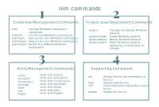

<h1>How To Use the Nimbella Command Line Tool</h1>

This document provides information about the Nimbella Command Line Tool, called nim, and its Command Line Interface (CLI). There are also several [Nimbella demo projects at GitHub](https://github.com/nimbella/demo-projects) that you can try out.

<h2>Table of Contents</h2>

[TOC]

---


<h2 id="your-nimbella-cloud-account">Your Nimbella cloud account</h2>

Your Nimbella cloud account gives you the following benefits:

*   A dedicated and secure domain name for your cloud applications. If you need more, let us know.
*   Static front-end assets are automatically deployed to and served from a global CDN.
*   Back-ends you can run on demand, near-instantly. No servers for you to manage.
*   A secured data bucket to upload files. Limit access as needed.
*   Application state recorded in a [Redis key-value store](https://redis.io), with data accessible to all your back-end logic at extremely low latency.
*   Workflows you can  build and the ability to orchestrate long-running tasks.
*   CLI and workbench tools to manage Nimbella services, build projects, and deploy your apps.

Once you [create your first Nimbella Cloud namespace](#create-a-nimbella-namespace) you are ready to login and [run CLI commands](#nim-command-overview) and deploy projects to your Nimbella Cloud.


<h2 id="install-the-nimbella-command-line-tool-nim">Install the Nimbella Command Line Tool (nim)</h2>

In most cases, we recommend that you use nim as a command to be invoked globally from shells or scripts. Here are the advantages of shell invocation:

*   The CLI is self-contained and has no dependencies on previously installed software.
*   You get automated update services when new versions are available.

If you don’t want a global installation but rather want to make nim a dependency of some other package, you can install it as a dependency with npm or yarn. See the second procedure.

<h3 id="install-nim-for-shell-invocation-globally">Install nim globally</h3>

1. Install nim according to your operating system:
   *   On Windows, download and run [the Windows installer]
       (https://apigcp.nimbella.io/downloads/nim/win/nim-x64.exe). 
   *   On Mac, download and run [the Mac installer]
       (https://apigcp.nimbella.io/downloads/nim/macos/nim.pkg).
   *   On Linux, run the following script:
       `curl https://apigcp.nimbella.io/downloads/nim/nim-install-linux.sh | sudo bash`
2. When the installation completes, run the following command: `nim update`

The `nim update` command verifies that nim is installed and capable of self-updating. If the initial installation happens not to be the latest version, the update step also corrects that.

<h3 id="install-nim-as-a-dependency">Install nim as a dependency</h3>

Use this method only to make nim a dependency of some other package. To invoke nim globally, use the previous procedure.

**Note:** When installed as a dependency, the `nim update` command will not work. You have to do a fresh install to get later versions.

1. Run either of the following commands, depending on whether you want to use npm or yarn:
  *   For npm: `npm install https://apigcp.nimbella.io/downloads/nim/nimbella-cli.tgz`
  *   For yarn: `yarn add https://apigcp.nimbella.io/downloads/nim/nimbella-cli.tgz`
 
2. When installation finishes, execute nim locally to the package into which it has been incorporated with the following command. For example using `npx nim ...`


<h2 id="nim-command-overview">nim command overview</h2>

The Nimbella Command Line Tool (nim) is your primary portal to Nimbella services. Typing `nim` at a command prompt produces the latest version of help output, similar to the following.

```
> nim
A comprehensive CLI for the Nimbella stack

VERSION
  nimbella-cli/0.1.9 darwin-x64 node-v10.16.3

USAGE
  $ nim [COMMAND]

COMMANDS
  action      work with actions
  activation  work with activations
  auth        manage Nimbella namespace credentials
  doc         display the full documentation of this CLI
  help        display help for nim
  info        show information about this version of 'nim'
  namespace   work with namespaces
  package     work with packages
  project     manage and deploy Nimbella projects
  route       work with routes
  rule        work with rules
  trigger     work with triggers
  update      update the nim CLI
```

These commands fall into four categories, shown in the following diagram and described in the following sections.


<h6>Figure 1: nim commands</h6>

**Note:** In the figure, the `auth:` subtree commands in the first group and `project:` subtree commands in the second group show colon separators because nim is based on [oclif](https://github.com/oclif), the Open CLI Framework from Heroku, which requires them. However, nim has logic to allow blank separators, so you can also use these commands with blank separators, as in these examples:

```
> nim auth list
> nim project deploy
```

If you find a case in which a blank separator doesn't work in nim, please [report it as an issue](https://github.com/nimbella/nimbella-cli/issues) or use a colon separator. 


<h3 id="1-credential-management-to-access-nimbella-namespaces">1 Credential management to access Nimbella namespaces</h3>

The `auth` subtree lets you manage Nimbella credentials for Nimbella _namespaces_, as described in the section [Nimbella Namespaces](#your-nimbella-cloud-account).

The `nim auth` subtree has its own set of commands, as follows.

```
> nim auth
Manage Nimbella namespace credentials

USAGE
  $ nim auth:COMMAND

COMMANDS
  auth:current  Get current namespace with optional details
  auth:list     List all your Nimbella Namespaces
  auth:login    Gain access to a Nimbella namespace
  auth:logout   Drop access to a Nimbella Namespace
  auth:switch   Switch to a different Nimbella namespace
```


<h3 id="2-project-level-deployment-commands">2 Project-level deployment commands</h3>

The `nim project` subtree has two commands: 

*   `deploy` 
*   `watch` 

These subcommands operate on logical groupings of resources (web content, storage, and APIs) that make up typical applications. Such a grouping is called a _project_ and is described more in [About Nimbella Projects](#overview-of-nimbella-projects-actions-and-deployment). 

The `project:deploy` command controls the Nimbella _deployer_, which operates on projects. Much of the rest of this document concerns itself with projects and the deployer. 

Help output for the `nim project` command:

```
> nim project
Manage and deploy Nimbella projects

USAGE
  $ nim project:COMMAND

COMMANDS
  project:deploy  Deploy Nimbella projects
  project:watch   Watch Nimbella projects, deploying incrementally on change
```

Help output for the `nim project deploy` command:

```
> nim project deploy
Deploy Nimbella projects

USAGE
  $ nim project:deploy [PROJECTS]

ARGUMENTS
  PROJECTS  one or more paths to projects

OPTIONS
  -v, --verbose      Verbose output
  --apihost=apihost  API host to use
  --auth=auth        OpenWhisk auth token to use
  --debug=debug      Debug level output
  --env=env          path to environment file
  --help             Show help
  --incremental      Deploy only changes since last deploy
  --insecure         Ignore SSL Certificates
  --target=target    the target namespace
  --verbose-build    Display build details
  --verbose-zip      Display start/end of zipping phase for each action
  --yarn             Use yarn instead of npm for node builds
```

See the [Example: Create and deploy a project with a single action](#example-create-and-deploy-a-project-with-a-single-action) for an example of using the project deploy command.

Help output for the `nim project watch` command:


```
> nim project watch --help
Watch Nimbella projects, deploying incrementally on change

USAGE
  $ nim project:watch [PROJECTS]

ARGUMENTS
  PROJECTS  one or more paths to projects

OPTIONS
  -v, --verbose      Verbose output
  --apihost=apihost  path to environment file
  --auth=auth        OpenWhisk auth token to use
  --debug=debug      Debug level output
  --env=env          path to environment file
  --help             Show help
  --insecure         Ignore SSL Certificates
  --target=target    the target namespace
  --verbose-build    Display build details
  --verbose-zip      Display start/end of zipping phase for each action
  --yarn             Use yarn instead of npm for node builds
```

See [Project watching](#project-watching-for-incremental-deployment) for an example of how to use this command for incremental deployment which facilitates faster project development.


<h3 id="3-entity-management-commands">3 Entity management commands</h3>

The `action`, `activation`, `namespace`, `package`, `route`, `rule` and `trigger` commands each manage the corresponding type of entity. 

If you’re an [Apache OpenWhisk](https://openwhisk.apache.org) developer, see [Entity Management commands in nim vs. wsk](#entity-management-commands-in-nim-vs-wsk) for a comparison of entity management commands.


<h3 id="4-supporting-commands">4 Supporting commands</h3>

The `doc`, `help`, `info` and `update` commands provide the following supporting services:

*   `doc`: Displays the documentation set for the nim CLI.
*   `help`: Displays help for nim.
*   `info`: Displays information about the version of nim that is installed.
*   `update`: Updates to the latest version of nim.

**Note:** `nim update` works only when nim is installed [using the recommended installation method for use from a shell](#install-nim-for-shell-invocation-globally). It does not work when nim is installed [as a dependency using npm or yarn](#install-nim-as-a-dependency).


<h2 id="nimbella-namespaces">Nimbella namespaces</h2>

You must have permission to use a specific namespace on the Nimbella platform In order to deploy a nim project and use many other nim capabilities.  A Nimbella namespace comes with resources such as object store buckets for web content and database instances, which are managed as part of the namespace. 

This section contains information about how to create a Nimbella namespace, view the credential store, and perform other tasks involving namespaces.


<h3 id="create-a-nimbella-namespace">Create a Nimbella namespace</h3>

Here’s how to create a Nimbella workspace in nim.

**To obtain a namespace using the Nimbella Command Line Tool:** 

1.  Visit [the Nimbella Early Access Request site](https://nimbella.com/request/). 
2.  Provide the information requested.
3.  Wait for an email response from Nimbella containing a _login token_, which is a very long mostly hexadecimal string. 
4.  Use `nim auth login` to activate your namespace, substituting our own login token in the following command:

```
> nim auth login <login token>
stored a credential set for namespace '...' and API host '...'
```


<h3 id="view-the-credential-store">View the credential store</h3>

A typical namespace is provisioned with the following:

*   Two storage buckets: one for web content and one accessible to actions for use as a virtual file system
*   A [Redis](https://redis.io) instance for storing key-value pairs
*   A DNS domain name for web content
*   A set of OpenWhisk resources 

After you’ve created a namespace, you can view it and information about it in the _credential store_. 

**To view the credential store in nim:**

*   Use the `auth list` command, as follows:

```
> nim auth list
Namespace            Current Storage  Redis API Host
<your namespace>       yes     yes     yes  https://...
```

Here’s more information about the table displayed in the response:

*   The **Current** column displays `yes` when there is just one namespace. The Nimbella deployer will deploy this namespace in the absence of other directives.
*   The **Storage** column indicates whether the namespace has provision for web content storage as discussed in [Adding static web content](https://nimbella.io/downloads/nim/nim.html#AddinsgWeb). There is also a second object storage bucket available for general use, not connected to the web.
*   The **Redis** column indicates whether the namespace has a Redis key-value storage instance available for use by actions.
*   Usually, a Nimbella developer has just one **API Host** and all namespaces use the same one. To add more API hosts, see the section on [Multiple API Hosts](#working-with-other-openwhisk-hosts).


<h3 id="create-and-manage-multiple-namespaces">Create and manage multiple namespaces</h3>

There are a number of reasons why it can be useful to have multiple namespaces. For example, while multiple applications can share a namespace, there are also good reasons to isolate them.

**To create additional namespaces:**

1.  [Contact Nimbella Support](https://nimbella.com/contact). 
2.  Identify yourself as an existing developer and provide the email you used for signing up initially.
3.  Wait for your login token via email.
4.  Use the auth login command as described in [Create a Nimbella Namespace](#create-a-nimbella-namespace). The additional namespace is added to your credential store.

**To view all of your namespaces:**

Follow the procedure to [view your credential store](#view-the-credential-store).
A newly added namespace is automatically set as current, indicated by a **yes** in the **Current** column.

<h4 id="switch-between-namespaces">Switch between namespaces</h4>

If you have more than one namespace, you can switch between them without needing to log into your account again by using the following command:

```
nim auth switch <namespace>
```

This changes the target namespace for future project deployments.

<h4 id="manage-multiple-namespaces">Manage multiple namespaces</h4>

The easiest way to manage multiple namespaces is to maintain the rule that each project is tied to its own namespace. To do this, add the following top-level directive to a _project.yml_ configuration file for each project:

```
targetNamespace: <namespace>
```

For more information about using _project.yml_ files to configure more complex projects, see [Adding Project Configuration](#adding-project-configuration).

There are more complex development scenarios, such as the case in which a single project may deploy to different namespaces, for example, a test namespace and a production namespace. This case can be managed by using the `--target` directive of the `project deploy` command:

```
nim project deploy <projectPath>... --target <namespace>
```

**Notes:**

*   If your project has a _project.yml_ configuration file with a `targetNamespace` directive and also uses the `--target` option in a `project deploy` command, the latter takes precedence. 
*   A value specified with the `--target` is remembered and will apply to subsequent deployments that do not use either `targetNamespace` or `--target` to specify a new target.

For more information about using _project.yml_ files to configure more complex projects, see [Adding Project Configuration](#adding-project-configuration).

If you need the deployment of a project to have different characteristics depending on the target namespace, such as parameters that might differ between test and production, you can use [symbolic substitution](https://nimbella.io/downloads/nim/nim.html#SymbolicVars), for example:

```
targetNamespace: ${NAMESPACE}
```

Provide the value of `NAMESPACE` in an environment file along with other substitutions.


<h2 id="overview-of-nimbella-projects-actions-and-deployment">Overview of Nimbella projects, actions, and deployment</h2>

A Nimbella _project_ is a logical grouping of static web content and _actions_. An action is a function or program encoded in a programming language supported by the Nimbella Cloud (e.g., JavaScript or Node.js, PHP, Python Java, or Go). An action usually produces some output in response to an event. For example, an action can be used to convert an image to text, update a stock portfolio, or generate a QR code. Actions are usually grouped into _packages_, but you can create them without a package qualifier if you wish.

Projects are _deployed_ as a unit into your Nimbella Cloud namespace to make them visible to your end-users to the extent that you wish. Your namespace can have any number of projects that you want. An application can have any number of projects to achieve its full functionality. This modular approach also lets you share projects across apps and namespaces.

Projects can contain actions, or actions plus static web content, or actions plus web content plus build steps. The following sections show you how to go from simple to complex:

*   [Example: Create and deploy a project with a single action](#example-create-and-deploy-a-project-with-a-single-action)
*   [Add static web content](#adding-static-web-content) to a project
*   [Add build steps](#incorporating-build-steps-for-actions-and-web-content) to a project

Projects can be deployed without any configuration, but in more complex cases you can 
[add a project configuration](#adding-project-configuration).

Finally, there are variations in how to [deploy projects](#about-projects), including [incremental deployment](#deploying-projects-incrementally) to reduce deployment time, especially during project development.


<h2 id="example-create-and-deploy-a-project-with-a-single-action">Example: Create and deploy a project with a single action</h2>

Let’s start with a really simple example that shows the basics of creating the source code for an action, placing it in a directory structure for a project, and deploying the project. This project needs no configuration and creates actions automatically based on the project directory structure.

In the simplest implementation of a project, each action corresponds to a single JavaScript or Node.js file. In this example:

*   A `Hello World` print function is placed in a file named _hello.js_.
*   A project named `example1` is created and deployed to your namespace. 

**To create and deploy a project to print Hello World:**

1. Create _hello.js_ with the following code:

```nodejs
function main(args) { return { msg: 'Hello World' } }
```

2. Create a project directory with the following command:

```
> mkdir -p example1/packages/demo
```

The [project directory structure](#about-projects) sets the name of the project (`example1`), a _packages_ directory, and the package qualifier (`demo`).

3. Copy the JavaScript file into the `demo` directory with the following command:

```
> cp hello.js example1/packages/demo
```

4. Deploy the project with the following command:

```
> nim project deploy example1
Deploying project '/path/to/example1'
  to namespace '...'
  on host 'https://...nimbella.io'

Deployed actions:
  - demo/hello
```

Here’s a diagram of the project structure that was created in this procedure.


<h6>Figure 2: Directory structure of the example1 project</h6>

**Notes:**

*   The `project deploy` command in the last step activates the deployer, which names the action automatically based on the source code file (`hello`), prepended by the package qualifier (`demo`).
*   If you want an action to have a simple name (no package qualification), put it in a package directory called _default_. In that case, no package qualifier is prepended. See [Project Directory Structure](#project-directory-structure).
*   The correct runtime for the source code file is determined according to the file suffix. See [Nimbella Deployer Supported Runtimes for Actions](#nimbella-deployer-supported-runtimes-for-actions) for a list of supported runtimes.
*   Project configuration occurs automatically when it can, but see [Adding Project Configuration](#adding-project-configuration) for complex projects.

**Next steps:**

*   To add web content to your project, see [Adding static web content](#adding-static-web-content).
*   If you need to add build steps, see [Incorporating build steps for actions and web content](#incorporating-build-steps-for-actions-and-web-content).
*   Read more about [deploying projects](#about-the-nimbella-deployer).
*   Look at a somewhat more complex [example QR code project with both an action and static web content](https://github.com/nimbella/demo-projects/tree/master/qrcode).


<h2 id="about-projects">About projects</h2>

A project represents a logical unit of functionality whose boundaries are up to you. Your app can contain one or more projects. The directory structure of a project triggers how the deployer finds and labels packages and actions, how it deploys static web content, and what it ignores. In more complex cases you can set more control over project deployment by adding a [project configuration](#adding-project-configuration).


<h3 id="project-directory-structure">Project directory structure</h3>

A project has a fixed directory structure, which determines how projects are deployed. Here’s a diagram that summarizes the directory structure of an individual project with no project configuration, with explanation below.


<h6>Figure 3: Basic directory structure of a project</h6>

The project has a root directory, within which a certain small number of directory names are significant to the deployer, specifically:

*   A _packages_ directory. Each subdirectory of _packages_ is treated as a package and is assumed to contain actions, in the form of either files or directories. Files in the _packages_ directory are ignored by the deployer.
*   A _web_ directory, which contains directories and files with static web content. 

Anything else in the root directory is ignored by the deployer, shown in blue in the diagram. This lets you store things in the root directory that need to be “off to the side,” such as build directories used by the deployer and project documentation. 


<h3 id="projects-with-multiple-actions">Projects with multiple actions</h3>

Adding more actions to a project is easy when each action is related to a single source code file. You can create as many subdirectories of the packages directory as you want and add as many source code files as you want to each subdirectory. (See [Project Directory Structure](#about-projects).) 

<!--FIXME these cp commands wont work for anyone as is remove the two paras below and code block

In the [example1 project procedure](#example-create-and-deploy-a-project-with-a-single-action) above, you would use `mkdir` commands to optionally create more subdirectories under `packages` add the source code files in those directories. For example, the following `mkdir` commands create _demo_, _admin_, _default_, and _test_ directories under the _packages_ directory. The `cp` commands copy the source code files for the actions under those subdirectories. The actions are automatically created from these source code files and named in relation to their directory structure. 

In this example, the resulting actions are listed under `Deployed actions` in the command output below. As described in the previous procedure, the actions from the _default_ subdirectory (`sampleJavaScript`, `samplePython`, and `welcome`), are created without a package qualifier prepended to the name.

```
> mkdir -p example1/packages/demo
> cp hello.js example1/packages/demo
> mkdir example1/packages/admin
> cp adduser.js example1/packages/admin
> mkdir example1/packages/default
> cp sampleJavaScript.js samplePython.py welcome.js example1/packages/default
> mkdir example1/packages/test
> cp work0.js work30.js example1/packages/test
> nim project deploy example1
	Result of deploying project '.../example1' 
	  to namespace '...' 
	on host 'https://...nimbella.io'
Deployed actions: 
	  - admin/adduser
	  - sampleJavaScript
	  - samplePython
	  - welcome
	  - demo/hello
	  - test/work0
	  - test/work30
```
-->


<h3 id="factors-in-choosing-project-size">Factors in choosing project size</h3>

There is no limit on how many packages and actions can be in a project.  However, using fewer very large projects or many small projects both have some negative ramifications, which are solved by using [incremental deployment](#deploying-projects-incrementally).

For example, you could create one large project. However, the default behavior of the deployer is to deploy everything in the project that it can, so deployment could become time-consuming. 

The other extreme is to create many small projects. You can use the `project deploy` command with a list of projects in a single invocation to deploy them all at once (e.g., `nim project deploy example1 example2 …`). Having lots of small projects may lengthen the build process, especially during iterative development. 

Incremental deployment facilitates deployment of both large and small projects, so you can create projects that make sense logically.


<h3 id="factors-in-choosing-project-boundaries">Factors in choosing project boundaries</h3>

Projects and actions are very flexible.

*   When deploying a project, all of its actions and web resources are installed into a single target namespace.
*   Multiple projects can deploy into the same namespace.
*   The actions within a project can span multiple packages and a given package can have actions contributed by multiple projects. 

In other words, _you_ decide on project boundaries based on deployment convenience.

**Note:** As a consequence of this flexibility, it’s important to watch for possible collisions between different projects trying to install the same resource. There are some audit trails that can help, described in [Deployer recordkeeping](#deployer-recordkeeping).


<h2 id="about-actions">About actions</h2>

<h3 id="actions-have-public-urls-by-default-unless-the-project-is-configured">Actions Have Public URLs by Default Unless the Project is Configured</h3>

Every action produced by a no-configuration project such as [the example project above](#example-create-and-deploy-a-project-with-a-single-action) is publicly accessible via a URL and is called a _web action_. You can retrieve the URL for any particular web action by using the `action get` command, as in the following example, which returns the URL for the `demo/hello` action created in the previous example.

```
> nim action get demo/hello --url 
https://....nimbella.io/api/v1/web/.../demo/hello
```

If you don’t want your actions to be publicly accessible through an unprotected URL, you’ll need to [add a project configuration](#adding-project-configuration).


<h3 id="using-zipped-source-files-to-form-a-single-action">Using zipped source files to form a single action</h3>

If you have more than one source file that must be bundled together to create a single action, you can zip the source files together as long as the file name and suffix take the following form _\<xxx\>.\<runtime\>.zip_.

The deployer normally [determines the runtime for the source file from the file’s suffix](#nimbella-deployer-supported-runtimes-for-actions), and the _.zip_ suffix doesn’t provide this information, so the runtime must be specified between the file name and the file suffix, demarcated by periods. For example, the name _hello.nodejs.zip_ can be used for a zipped action whose action name is `hello` and whose runtime kind is the default version of Node.js. 

If you want to force a specific runtime version, use a file of this form instead: _hello.nodejs-8.zip_. The Nimbella Cloud must support the version you specify.

Some language runtimes, such as Java, also accept specialized archives such as _.jar_ files, or they directly accept binary executables. In this case, the runtime is determined by the file extension in the normal manner, such as _hello.jar_. Other cases are not specially handled by nim and might require [adding a project configuration](#adding-project-configuration).

Zipped actions are usually created in a separate build step. As an alternative, Nimbella has [an autozip feature triggered by directory structure](#multifile-actions-created-with-autozip).


<h3 id="multifile-actions-created-with-autozip">Multifile actions created with autozip</h3>

By adding an extra directory under the action directory, you can trigger an autozip of your action source files by creating a directory between the action directory and the source files and meeting certain conditions. Suppose the [example1 project](#example-create-and-deploy-a-project-with-a-single-action) has a `hello` action with two source files: _helloMain.js_ and _helloAux.js_. To create the `demo/hello` action, add a `hello` directory as a child of the `demo` directory, as shown in this diagram.


<h6>Figure 4: Two source files in an action directory for automatic zipping</h6>

The difference from the [example1 directory structure](#figure-2-directory-structure-of-the-example1-project) is that the `hello` action is a _directory_ rather than a single source file. The source files in the directory are zipped automatically to form the action. 

<!-- FIXME REMOVE THESE 
Here are the commands to create the directory structure for this autozipping to occur.

```
> mkdir -p example2/packages/demo/hello
> cp helloMain.js helloAux.js example2/packages/demo/hello
> nim project deploy example2
Result of deploying project '.../example2'
	to namespace '...'
	on host 'https://...nimbella.io'
	Deployed actions:
	- demo/hello
```
-->

For autozipping to work in a project with no configuration, the following conditions must be met:

*   At least one source file must have [a suffix from which the runtime type can be inferred](#nimbella-deployer-supported-runtimes-for-actions).
*   All source files must be of the same type so they can use the same runtime.
*   Exactly one file must contain an identifiable `main` entry point, as required by the particular runtime selected. 

These conditions can be relaxed by using [project configuration](#adding-project-configuration).

Subdirectories can be present under an action directory (for example, a `node_modules` directory as in the following diagram). These directories are zipped up with everything else under the action directory.


<h6>Figure 5: Autozipping a subdirectory of an action directory</h6>

You can optionally limit the files to be zipped in either of two ways:

*   Add a file called `.include`, which lists exactly the items to be included. Anything else in the action directory is excluded. Wildcards are not permitted in this file but entries can denote directories as well as files. The `.include` file can also be used for linking to somewhere else in the filesystem, as described in [Using an action source from elsewhere in the filesystem](#using-an-action-source-file-from-elsewhere-in-the-filesystem).
*   Add a file called `.ignore`, stating which files and directories _not_ to include. The `.ignore` file follows the same rules as `.gitignore` and has the same effect. It is not necessary to list `.ignore` inside itself. It is automatically ignored, as are certain build-related files.

You cannot have both a `.include` and `.ignore` in the same action directory.

**Note:** No zipping occurs in any of the following cases:

*   The directory representing the action contains only a single file.
*   Only one file is listed in `.include`.
*   Only one file is left after applying the rules in `.ignore`.


<h4 id="using-an-action-source-file-from-elsewhere-in-the-filesystem">Using an action source file from elsewhere in the filesystem</h4>

If you use an `.include` file, it can contain entries that denote files or directories outside the action directory. Entries can be either absolute paths or paths that are relative to the action directory using standard `../` notation. 

**Note:** Although paths in `.include` can terminate outside the project, it becomes harder to relocate the project. It’s better practice to include files within the project. If they are directories that you want the deployer to ignore, you can put them in the root directory, as described in [About projects](#about-projects).

Entries in `.include` are interpreted differently if they are absolute or relative. If the path is relative, the resulting entries in the zip file start with the last segment of the listed path. Here are two examples:

*   If you have `../../../lib/node_modules`, the contents of the node_modules directory are zipped but files inside the directory have the form `node_modules/<path>`. 
*   If you have `../../../lib/helpers.js` the file becomes just `helpers.js`.


<h2 id="adding-static-web-content">Adding static web content</h2>

To add static web content to a project, add a directory called _web_ as a peer of the directory called _packages_. This directory should contain files whose suffixes imply well-known mime types for web content, such as _.html_, _.css_, or _.js_. 

**Note:** JavaScript files in static web content are _not_ actions but are scripts intended to run in the browser.

The _web_ directory can have subdirectories and can be built by website builders or other tools.

Like an action directory, the _web_ directory may contain `.include` or `.ignore` to control what is actually considered web content, as opposed to build support or intermediate results. For more information about `.include` and `.ignore`, see [Multifile actions created with autozip](#multifile-actions-created-with-autozip).

The _web_ directory also supports integrated [building](#FIXME), just like an action directory.

Here’s an example of a project with modest web content, populated by hand. For simplicity, the actions of the project are not shown.

```
example3/web/chatroom.html
example3/web/chatroom.css
example3/web/runner.js
example3/web/favicon.ico
```

Here’s a diagram of the `example3` project structure.


<h6>Figure 6: A project with static web content</h6>

Here’s the output when the project is deployed.

```
> nim project deploy example3
Deploying project '/path/to/example3'
  to namespace '...'
  on host 'https://...nimbella.io'

Deployed 4 web content items to 
  https://<namespace>-host.nimbella.io
Deployed actions:
  ...
```

As the output shows, the contents of the web directory were deployed to the web, with URLs within your namespace’s unique DNS domain `<namespace>-host.nimbella.io`, where `<namespace>` is your namespace. The remaining portion of the domain name may differ depending your account configuration and your API host within the Nimbella Cloud. To access the content, either `http` or `https` may be used. For `https`, the SSL certificate will be that of Nimbella Corp.

**Notes:**

*   For a web deployment to work correctly, the namespace entry in the credential store must include storage. See [View the Credential Store](#view-the-credential-store) to generate the credential store, then check to make sure the `Storage` column of the response says `yes`. The first namespace created for each user includes storage, but it’s possible to create namespaces without it.
*   You can add [project configuration to change how your static web content is deployed](#project-configuration-for-web-content).
See [an example of how to configure a project when you generate web content with a tool such as React.](#configuration-example-for-web-content-generated-by-a-tool)

<!--FIXME
*   If your Nimbella namespace doesn’t have storage, an alternative is to use a form of deployment called _action wrapping_. See [The action wrapping alternative for deploying web content](#the-action-wrapping-alternative-for-deploying-web-content).
-->


<h2 id="about-the-nimbella-deployer">About the Nimbella deployer</h2>


<h3 id="nimbella-deployer-supported-runtimes-for-actions">Nimbella deployer supported runtimes for actions</h3>


The Nimbella deployer determines the kind of runtime required for the action from the file suffix. The follwing runtimes are supported:

*   Node.js for suffix _.js_
*   Python for suffix _.py_
*   Java for suffixes _.java_ and _.jar_
*   Swift suffix _.swift_
*   PHP for suffix _.php_
*   Go for suffix _.go_


<h3 id="deploying-projects-incrementally">Deploying projects incrementally</h3>

Instead of deploying your entire project each time you make a change to the file contents, you can use incremental deployment to detect and deploy changes in the following:

*   Project structure
*   Project content
*   [Project configuration](#adding-project-configuration) (if you have created one)

This is a great time-saver during project development and also helps [facilitate deployment when your project is large](#factors-in-choosing-project-size).

Consider the following example of an `example4` project. The output from standard deployment is shown here:


```
> nim project deploy example4
Deploying project '/path/to/example4'
  to namespace '...'
  on host 'https://...nimbella.io'
Deployed actions:
  - admin/adduser
  - welcome
  - demo/hello
```

Now suppose that you’ve made changes to `demo/hello` and `welcome` but not the others. You aren’t ready to do a production deployment or submit for testing, you just want to deploy what’s changed so you can continue developing. 

To deploy incrementally, use the `--incremental` flag, as in the following example.


```
> nim project deploy example4 --incremental
Deploying project '/path/to/example4'
  to namespace '...'
  on host 'https://...nimbella.io'
Deployed actions:
  - welcome
  - demo/hello
Skipped 1 unchanged action
```

Changes to actions and web content are tracked by means of digests created by the deployer and described in more detail in [Deployer recordkeeping](#deployer-recordkeeping). The deployer skips the uploads of actions and web content whose digests have not changed. Digests are computed over an action’s contents and also its metadata, so if you use a [project configuration](#adding-project-configuration) file to change the properties of an action, those changes are detected as well. 

The `--incremental` option also skips rezipping large multi-file actions whose included contents are older than the last zip file.

The `--incremental` option is accurate in determining what has changed unless you add build steps. After you add build steps, some heuristics come into play, as discussed in [Build States and the Effect of --incremental on Builds](#build-states-and-the-effect-of-incremental-on-builds).


<h4 id="project-watching-for-incremental-deployment">Project watching for incremental deployment</h4>

A good way to implement incremental deployment during project development is to use `nim project watch`. The `project watch` command typically runs until interrupted in a devoted terminal window so you can work elsewhere, such as in your favorite IDE.

Here’s an example of using this command for incremental deployment.

```
> nim project watch example4
Watching 'example4' [use Control-C to terminate]
...
Deploying 'example4' due to change in 'path/to/packages/demo/hello'

Skipped 4 unchanged web resources on
  https://<namespace>-host.nimbella.io
Deployed actions:
  - demo/hello
Deployment complete.  Resuming watch.
```

<!--FIXME remove this
The ellipsis in the example appears in the actual output and represents a passage of time during which the _[project.yml configuration](#adding-project-configuration)_ was changed in a way that did not affect the semantics of the action `demo/hello`. If it had, `demo/hello` would have been redeployed. 
-->

The `project watch` command accepts a list of projects and most of the flags that project `deploy` accepts, as described in [Project-Level Deployment Commands](#2-project-level-deployment-commands). An exception is `--incremental`, which is assumed. 


<h3 id="deployer-recordkeeping">Deployer recordkeeping</h3>

The deployer creates two types of audit trails:

1.   One for actions and packages deployed to your namespace
2.   One for actions, packages and web content in your local project.  

We’ll describe each type and show how they differ and how they can be used for comparison.


<h4 id="annotations-for-actions-and-packages-deployed-to-your-namespace">Annotations for actions and packages deployed to your namespace</h4>

Version numbers for actions and packages are incremented on each update, and the `action get` command generates information about a deployed package or action in your namespace. 

**Note:** Web content does not have version numbers. Its changes are tracked by maintaining content digests of the current files on your local system versus the latest-deployed files from the project. See [Recordkeeping in your local project](#recordkeeping-in-your-local-project) for an example.

As shown in the following example, the `action get` command output shows the namespace, the name of the action or package, and and its version in the namespace. In addition, the command output displays the annotation data that the the deployer generates in each action and package it deploys. If your project is managed by git, the annotations contain a variety of information about the storage in your git repository, as described below. If your project isn’t managed by git, it contains the project path and the user who created the project.

<h5 id="typical-action-get-command-output">Typical action get command output</h5>

In this example, the `action get` command retrieves the annotation for the `demo/hello` action from [example1](#example-create-and-deploy-a-project-with-a-single-action):

```
> nim action get demo/hello
{
  "namespace": ".../demo",
  "name": "hello",
  "version": "0.0.1",	
  ...
  "annotations": [
    {
      "key": "deployer",
      "value": {
        "repository": "...",
        "commit": "...",
        "digest": "...",
        "projectPath": "...",
        "user": "..."
        }
      },
      ...
  ],
  ...
}
```

In the first section of output:

*   `namespace` shows the namespace name plus the project’s package name.
*   `name` shows the name of the action.
*   `version` shows the version of the action that’s in your namespace.
This is the version that you’d compare with the version in `/path/to/example1/.nimbella/versions` to see if they match. If they do not, you’d then start looking for another project that may have placed that file there.

The `annotations` details for the key `deployer` vary according to whether the deployed project is under git control.

**If the deployed project is managed by git:**

*   `repository` is the value given by `git config --get remote.origin.url`.
*   `commit` is the `githash` of the most recent commit, with` ++` added if the working copy contains uncommitted changes.
*   `digest` is the digest of the code and the metadata of either the action or the package (the same value that is stored locally for controlling incremental deployment).
*   `projectPath` is the path of the project within the repository clone, relative to the repository root.
*   `user` is the value given by `git config --get user.email`.

**If the deployed project does not appear to be under git control:**

*   The `repository` and `commit` fields are omitted.
*   `digest` is the digest of the code and the metadata of either the action or the package (the same value that is stored locally for controlling incremental deployment).
*   The `projectPath` is absolute.
*   `user` is the local user name according to the operating system.


<h4 id="recordkeeping-in-your-local-project">Recordkeeping in your local project</h4>

The deployer records information about your local project in a single file called `versions.json` in a project subdirectory named `.nimbella`. For actions and packages, the deployer records the last-deployed version in your local project. For actions, packages, and web content, the deployer also creates digests, which are used for [incremental deployment](#deploying-projects-incrementally). 
Looking at the information in `versions.json` answers the question _“What did you last put in the namespace using this project?"_

**Note:** Do not edit any files in the `.nimbella` directory.


<h5 id="typical-versions-json-file-content">Typical versions.json file content</h5>

The `versions.json_`entries for packages and actions look something like this:

```
[
  {
    "apihost": "https://...",
    "namespace": "...",
    "packageVersions": {
      "demo": {
        "version": "0.0.1",
        "digest": "ab87f791f2d2..."
      }
    },
    "actionVersions": {
      "demo/hello": {
        "version": "0.0.3",
        "digest": "ca5b7a03c1bb..."
      }
    }
  }
}
```

In this example, you can see that there are separate status entries for the package `demo` and the action `demo/hello`. The entry for the package and for each action includes both a `version` field, showing the last-deployed version number, and a `digest` field, which is used to control [incremental deployment](#deploying-projects-incrementally). The fact that the package and action have different versions suggests that incremental deployment has been used.

If you have also deployed static web content, the `versions.json` file has a `webHashes` entry with digest information about each web file, something like this:

```
"webHashes": {
  "qrcode/web/index.html": "56bc228c3f5b8a33e59224bdadd8a7d8674dbc1e774a97af4cb62a355f585276",
  "qrcode/web/logo.png": "302f6b60c3b73ac23df07e528d14ef740576ac5966cdd5ea4884f03d0a532a71"
}
```


<h4 id="comparing-versions-in-your-namespace-versus-local-project">Comparing versions in your namespace versus local project</h4>

The namespace vs. local project recordkeeping is particularly useful for comparing version numbers between the local copy of the project and what’s actually in your namespace. For example, as described in [Factors in choosing project boundaries](#factors-in-choosing-project-boundaries), there can be collisions between different projects trying to install the same resource. If you use the `action get` command and find that the` demo/hello` action in your namespace is at version `0.0.2` while the `.nimbella/versions.json` content tell you that the deployer last deployed version `0.0.1` from your local project, it means that the action was updated in your namespace outside the deployer or by some other project or copy of this project. At that point, you might have to inspect the deployed action further to disambiguate the two versions.

**Notes:**

*   If you have a [project configuration](https://nimbella.io/downloads/nim/nim.html#Configuring) that uses one of the options to clean an action, package or namespace prior to deploying, then the version numbering of the cleaned action starts over again at `0.0.1`.
*   If you deploy to different namespaces or API hosts at different times, the array in `versions.json` will have more than one entry, with versions for the last deployment to each distinct API host/namespace target.


<h2 id="incorporating-build-steps-for-actions-and-web-content">Incorporating build steps for actions and web content</h2>

The _web_ directory and any directory that represents an action can be built automatically as part of deployment. You can trigger this behavior in one of three ways.

*   By placing a file called `build.sh` (for Mac or Linux), or `build.cmd` (for Windows), or both, in each directory in which you want builds to occur. This could be the web directory for web content or any of the action directories. Each build file should contain a shell script to execute with the directory in which it’s placed as the current directory.
**Note:** If both _.sh_ and _.cmd_ files are provided, only the one appropriate for the current operating system will be used. If only one is provided, the deployer will run on systems for which that kind of script is appropriate and indicate an error on other systems.

*   By placing a file called `.build` in each directory in which you want builds to occur. The rules for this option are explained under [out-of-line builds](https://nimbella.io/downloads/nim/nim.html#OutOfLineBuild) below.

*   By placing a `package.json` file in in each directory in which you want builds to occur. The presence of this file causes the following command `npm install --production`  to be executed. To override this command to use a `yarn` installation, use the flag `--yarn` on the `nim project deploy` command, which causes `yarn install --production` to be executed instead, with the directory as the current directory.

These three triggers are examined in this order, and when the deployer finds one, it does not consider the others. The exception is that a script in `build.sh` or `build.cmd` can always do its own `npm install` or `yarn install`.

**Tip:** `build.sh`, `build.cmd`, and `.build` are automatically ignored and do not have to be listed in `.ignore`. However, `package.json` is not automatically ignored in this way.

Building precedes the determination of what web files to upload or which action directories to zip into the action. This has two implications:

*   You can optionally use the script to generate the `.include` or `.ignore` file that refines this process.
*   If the build is designed to produce a _.zip_ file directly, you must ensure that there are no other files that will be interpreted as a part of the action, or else the deployer will do its own zipping. The easiest way to ensure that there is only one zip file is to use a one-line `.include` file.


<h3 id="examples-of-building-common-use-cases">Examples of building (common use cases)</h3>

Let’s start with a simple node dependency.

Project `example5` has a function in a single source file but it has node/npm-style dependencies. Here is a part of the project layout:

_example5/packages \
example5/packages/demo \
example5/packages/demo/qrfunc \
example5/packages/demo/qrfunc/package.json \
example5/packages/demo/qrfunc/qr.js_

Let’s deploy example5 to show how little effort is needed.


```
> nim project deploy example5
	Running 'npm install' in example5/packages/demo/qrfunc
Result of deploying project 'example5' to namespace '...'
	  on host 'https://...nimbella.io'
Deployed actions:
	  - demo/qrfunc
	  ...
```


The presence of _package.json_ triggers the npm install, after which the normal behavior for [multifile actions (autozipping)](#multifile-actions-created-with-autozip) takes over and creates a zip file to upload that contains _qr.js_, _package.json_, and the entire _node_modules_ directory generated by npm. If you try this yourself, bear in mind that the runtime for Node.js requires either that _package.json_ provide an accurate designation of the main file or else that the file be called _index.js_.

Now let’s consider a case in which there are many actions, each with unique content, but only one _node_modules_ directory.

_example6/build \
example6/build/.shared \
example6/build/package.json \
example6/packages \
example6/packages/default \
example6/packages/default/test1 \
example6/packages/default/test1/.build \
example6/packages/default/test1/index.js\ \
example6/packages/default/test1/.include \
example6/packages/default/test2 \
example6/packages/default/test2/.build \
example6/packages/default/test2/index.js \
example6/packages/default/test2/.include_

The _package.json_ in the _build_ directory specifies `the common Node JS dependencies of the code in the actions`. The _.shared_ file is empty – it’s just a marker `indicating that the build is shared`. 

Each _.build_ directive looks like this:


```
../../../build
```


Each _.include_ file looks like this:


```
../../../build/package.json
../../../build/node_modules
index.js
```


Keep in mind that individual actions can have more than one source file, but they need to share the same _package.json_ if they want to use the common build. In this case, they need to use the same main file name (_index.js_ in this case). 

A project can have a mixture of actions that share builds and actions that don’t share builds. If you want some actions to have their own _package.json_, add the _package.json_ file and remove _.build_. Those actions then have their own dependencies and their own npm install or yarn install but then they are not using the common _package.json_ file anymore. 

Another way to use a common build is to use a shell script and put logic there that completely populates the actions and web content, all of which simply point to it. It will execute exactly once, walk the directory structure of the project, and do whatever needs doing.

<h3 id="errors-in-builds">Errors in builds</h3>


The deployer decides whether a build has failed based on examining the return code from a subprocess running the build and it displays all of its output, both on `stdout` and on `stderr`. However, if there is no return code (when a build returns a zero), the deployer does not display any output. Therefore, it’s good practice to ensure that a build will set a nonzero return code on failure.

**Tip: **If you suspect a build is not doing what you expect but there is no visible error, try rerunning `nim project deploy` with the `--verbose-build` flag. This causes the entire build output to display on the console, regardless of apparent success. This will often reveal errors in the build that are being swallowed because the build is returning zero despite the errors.

<h3 id="out-of-line-builds-and-shared-builds">Out-of-line builds and shared builds</h3>


There are four possible outcomes when using “out-of-line” building with the _.build_ directive:


*   If _.build_ contains a single line giving the pathname of a file, that file is taken to be a script and is executed with the directory containing _.build_ as the current directory. \
Most script languages allow a script to determine the directory in which it is running from this pathname. The deployer always executes scripts via their full pathname, so the script will have both its own directory and the web or action directory to work with.
*   If _.build_ contains a single line giving the pathname of a directory, that directory is made current and building is performed there, assuming a _build.sh_, _build.cmd_, or _package.json_ build file can be found, with the file priority described in [Incorporating build steps for actions and web content](#incorporating-build-steps-for-actions-and-web-content).  \
Recursive use of _.build_ is not supported.
*   If _.build_ contains a single line giving the pathname of a directory and this directory contains a file called .shared, the deployer ensures that the build in that directory is only run once. This behavior doesn’t depend on the contents of _.share_.
    *   This can allow multiple actions to share the same build even if there are many such actions and the build is time-consuming to run.
    *   This can be useful in scenarios in which actions share a lot of common content.
*   The deployer indicates an error if any of the following conditions exist: 
    *   _.build contains_ more than one line.
    *   _.build_ is empty.
    *   _.build_ denotes a file or directory that does not exist
    *   _.build_ denotes a directory that doesn’t contain one of the recognized build directives. 

**Tip:** You can place directories containing out-of-line building support in the project root as long as the directory names don’t conflict with the reserved names _web_, _packages_, _.nimbella_, or _project.yml_.

<h3 id="build-states-and-the-effect-of-incremental-on-builds">Build states and the effect of --incremental on builds</h3>


Using the `--incremental` option has an effect on whether or not builds are executed.  To understand how this works, it’s important to understand build state, because `an incremental deploy only rebuilds web or action if it's in the unbuilt state.`

<h4 id="two-build-states-built-and-unbuilt">Two build states: Built and Unbuilt</h4>


A Built or Unbuilt state is applied to the following directory types:


*   Each action that has a build step
*   The _web_ directory


```
In this discussion, we'll refer to "the directory" to mean either of these two directory types.
```


If the directory is in the Unbuilt state, the build is run as usual, prior to determining `whether something should be deployed when deploying incrementally`. 

If the directory is in the Built state, incremental deployment proceeds `to deciding whether a change has occurred without running the build again`. 

<h4 id="what-determines-built-or-unbuilt-states">What determines built or unbuilt states</h4>


Build state is determined as follows:

If the build is triggered by _package.json_, the directory is considered Built if and only if:


*   It contains a _package-lock.json_ (if run with `npm`) or _yarn.lock_ (if run with `yarn`) and a _node_modules_ directory, both of which are newer than the _package.json_.  \
If both _package-lock.json_ and _yarn.lock_ are present, the newer of the two is used in this determination.

If the build employs a script, then the directory is considered Built if and only if:


*   The directory containing the script also contains a file called _.built_.  \
For out-of-line builds, the directory containing the script is usually not the action directory.

In the script case, the convention of using a _.built_ marker to suppress subsequent builds requires the script to set this marker when it executes. It’s a very coarse-grained heuristic, which is used because:


*   The deployer doesn’t know the dependencies of the build.
*   It’s better to err in the direction of efficiency when doing incremental deploying. 

If you have problems with an incremental build, you always have the remedy of running a full deploy. 

**Note:** The use of this convention of using the _.built_ marker is optional. If the script does not create a _.built_ marker, it always runs, which is fine if the script does dependency analysis and rebuilds only what it needs to.

The _package.json_ case also employs a heuristic and won’t be perfectly accurate if the _package.json_ contains scripts that run as part of the install step. However, it works well in simple cases. Again, you always have the fallback of running a full deploy.


---


<h2 id="adding-project-configuration">Adding project configuration</h2>


A feature that sets nim projects apart from many other deployment tools is that no manifest or configuration file is required in a large number of suitably simple cases. You can simply choose a directory in the file system to represent a project and lay out the content of the project under that directory using a structure that nim will recognize as a project. See [the no-configuration project example](#example-create-and-deploy-a-project-with-a-single-action).

However, Nimbella projects can’t always avoid having a configuration file, so this section summarizes how to add a configuration file to guide nim when the file and directory structure doesn’t convey everything it needs to know.

To configure a project, create a configuration file called _project.yml_ in the project’s root directory. The configuration file is coded in YAML. There are various online tutorials for YAML if you need to learn more about the YAML language.

The structure of the information in the _project.yml_ file should follow the structure of the project itself. In this example, the actions are nested under packages to follow the directory structure of a Nimbella project.


```
<globalStuff: ...>
Packages:
  - name: pkg1
    pkg1modifier1: …
    pkg1modifier2: …
    Actions:
      - name: action1
        action1modifier1: …
        action1modifier2: …
  - name: pkg2
    ...
```


The project configuration is merged with what is inferred from file and directory names, so it’s only necessary to put information in the configuration that can’t be inferred from file or directory names or for which the defaults aren’t what you want. 

We’ll cover configuration for packages and actions first, then configuration for web content, including an example of generated content such as a React web app. Then we’ll cover symbolic variables and file substitution.

<h3 id="project-configuration-for-packages-and-actions">Project configuration for packages and actions</h3>


Let’s suppose that in [the example1 project](#example-create-and-deploy-a-project-with-a-single-action), you don’t want `hello` to be a web action and the deployer cannot determine its main entry point directly from the code. Add a _project.yml_ file such as the following:


```
Packages:
  - name: demo
    Actions:
      - name: hello
        web: false
        main: myMain
    Limits:
     	timeout: 10000
```


The following sections contain a list of configuration members for [actions](#action-modifiers-allowed-in-project-yml), [packages](#package-modifiers-allowed-in-project-yml), and [global](#global-modifiers-allowed-in-project-yml). Two additional configuration members are `bucket` and `actionWrapPackage`, which are documented in [Adding static web content](#adding-static-web-content) and [The action wrapping alternative for deploying web content](#the-action-wrapping-alternative-for-deploying-web-content), respectively.

<h4 id="action-modifiers-allowed-in-project-yml">Action modifiers allowed in project.yml</h4>


Here are the action modifiers that are allowed in the configuration.

<h5 id="web">web</h5>


May be `true`, `false` or `raw`. The default is `true`.

The `web` modifier has the same semantics as it does in `nim action create`, except for the default. The value `yes` or `true` produces a normal web action. The value `no` or `false` produces an action that is not a web action. The value `raw` produces a raw HTTP web action. The default is `true` if not specified. These behaviors are accomplished via annotations with reserved meanings that are merged with annotations provided by you.

<h5 id="runtime">runtime</h5>


The runtime to use for the action. It should be in the form "language:version", for example "python:3" or "language:default", for example "go:default". Because of the colon, the string should be quoted, as in these examples.

<h5 id="main">main</h5>


The main entry point for the action.

<h5 id="binary">binary</h5>


May be true or false. The value true indicates the need for base64 encoding when transmitting the action for deployment. Normally this is inferred from the file suffix.

<h5>webSecure </h5>


Secures the website with a secret that the user must provide in order to create an action. The value may be `true` (nim generates the secret for you),  a string containing the secret, or `false` (the default, which means anyone can create an action).

<h5 id="annotations">annotations</h5>


A nested map providing annotations to place on the action. See [Deployer Recordkeeping](#deployer-recordkeeping).

The keys and values of annotations are up to you to create. The important thing is that both clauses are nested maps in YAML terms and can have as many keys and values as needed. See the example in the <code>[parameters](#parameters)</code> description.

<h5>parameters </h5>


A nested map providing parameters, which are bound to the action and passed on each invocation.

The keys and values of parameters are up to you to create. The important thing is that both clauses are nested maps in YAML terms and can have as many keys and values as needed.  The following example shows some key-value pairs created for the `annotations` and `parameters` modifiers for the `hello` action in the `demo` package.


```
Packages:
  - name: demo
    Actions:
      - name: hello
        Annotations:
          final: true
          sampleAction: true
        Parameters:
          language: English
```


<h5 id="environment">environment</h5>


A nested map providing parameters that are placed in the environment of the action before each invocation

<h5 id="clean">clean</h5>


May be `true` or `false`, indicating whether you want any previous action with the same name to be removed before deploying a new one. The default is `false`.

The `clean` modifier requires some explanation. The deployer installs actions using the update verb, meaning that there is some history maintained in the installed action. The version number is incremented. Parameters and annotations from a previous incarnation will be retained unless changed. The code is always installed anew, however. The `clean` flag guarantees that the action is built only from the information in the project by erasing any old copy of the action before deploying the new one.

**Notes: **


*   See also the <code>[clean flag on packages](#clean)</code> and the <code>[cleanNamespace global flag](#cleannamespace)</code>.
*   The <code>clean</code> flags on actions are ignored when the --incremental flag is specified.

<h5 id="limits">limits</h5>


A nested map in which you can set limits for the timeout in milliseconds, memory in megabytes, and the number of logs. All three of these limits must be numbers and within the range permitted by the Nimbella cloud ([see this page](https://apigcp.nimbella.io/api/v1) for limits). When not specified, Nimbella Cloud defaults are assumed.

<h4 id="package-modifiers-allowed-in-project-yml">Package modifiers allowed in project.yml</h4>


The package modifiers that can go in the configuration are as follows.

<h5>shared </h5>


May be `false` (default) or `true`. It indicates that the contents of the package are accessible to other authorized users.

<h5>annotations </h5>


A nested map providing annotations to place on the package. See [Deployer Recordkeeping](#deployer-recordkeeping).

The keys and values of `annotations` are up to you to create. The important thing is that both clauses are nested maps in YAML terms and can have as many keys and values as needed. See the example in the <code>[parameters](#parameters)</code> modifier for actions.

<h5 id="parameters">parameters</h5>


A nested map providing parameters to be bound to all of the actions of the package and passed on each invocation.

The keys and values of `parameters` are up to you to create. The important thing is that both clauses are nested maps in YAML terms and can have as many keys and values as needed. See the example in the <code>[parameters](#parameters)</code> modifier for actions.

<h5 id="environment">environment</h5>


A nested map providing parameters to be placed in the environment of all the actions of the package before each invocation.

<h5 id="clean">clean</h5>


May be `true` or `false`, indicating whether you want any previous package with the same name and all of its contained actions to be removed before deploying a new one. The default is `false`.

**Notes:** 


*   `clean` at the package level is not the same as specifying clean on each action of the package. At package level, the `clean` flag removes all actions from the package before deploying, even ones that are not being deployed by the present project. It also removes package parameters and annotations. The `clean` flag at the package level is only appropriate when you want the project to “own” a particular package outright. See also the <code>[clean flag on actions](#clean)</code> and the <code>[cleanNamespace global flag](#cleannamespace)</code>.
*   The <code>clean</code> flag on packages is ignored when the --incremental flag is specified.

<h4 id="global-modifiers-allowed-in-project-yml">Global modifiers allowed in project.yml</h4>


There are also some useful global members of the configuration.

<h5>targetNamespace </h5>


Selects the namespace to which the project will be deployed. This option is unnecessary unless you have multiple namespaces (discussed under [Managing Multiple Namespaces](https://nimbella.io/downloads/nim/nim.html#MultiNS)).

<h5>cleanNamespace </h5>


May be `true` or `false` (default). It causes the entire namespace to be cleared of content prior to deployment: actions, package, and web content. Set this option to `true` only if you intend the project to have total ownership of the namespace.

**Notes: **


*   See also the <code>[clean flag on actions](#clean)</code> and the <code>[clean flag](#cleannamespace)</code>.
*   The <code>cleanNamespace</code> global flag is ignored when the --incremental flag is specified.

<h5 id="parameters">parameters</h5>


A nested map providing parameters to place on every package in the project. This option generalizes the feature by which parameters on packages are distributed to the contained actions. Placing parameters at the top level causes them to be indirectly inherited by every action in the project.

<h3 id="project-configuration-for-web-content">Project configuration for web content</h3>


The project.yml file can also contain configuration that controls how the web directory and web content is deployed.  

<h4 id="use-the-yaml-bucket-member-to-configure-how-web-content-is-deployed">Use the YAML bucket member to configure how web content is deployed</h4>


Adding a `bucket` member at the top level of _project.yml_ provides several options for configuring deployment of your web content, as shown in the following example and described in the sections below. All entries are optional.


```
Bucket:
  prefixPath: "chatroom"
  clean: true
  mainPageSuffix: chatroom.html
  notFoundPage: "error.html"
  strip: 1
```


The following sections have a description of the `bucket` options shown in this example.

<h5 id="share-a-nimbella-namespace-with-prefixpath">Share a Nimbella namespace with prefixpath</h5>


When `https://<ns>-apigcp.nimbella.io` is used as a URL with no additional path component, a path of _/index.html_ is assumed, but If your web content doesn’t require being placed at the root of the URL path space, you can allow web content from different projects to share a namespace and a hostname. This is done by using prefix paths to place each project’s web content in a different location. The Nimbella deployer does not rewrite URLs internal to your content, but you can configure prefix paths by adding a 

The path specified in `prefixpath` is prepended to every URL path whenever resources are uploaded. For example, given the examples above, the resource _runner.js_ would be deployed to _https://<ns>-apigcp.nimbella.io/chatroom/runner.js_.

<h5 id="delete-previously-deployed-content-when-new-content-is-deployed">Delete previously deployed content when new content is deployed</h5>


If the `clean` flag is `true`, all previously deployed web content is deleted prior to deploying new content. The default is `false`, in which case previously deployed web content is allowed to remain. 

**Tip: **A top-level `cleanNamespace: true` designation clears both web content and actions prior to a new deployment.

<h5 id="configure-behavior-when-the-url-denotes-a-directory">Configure behavior when the URL denotes a directory</h5>


You can configure which file opens when a URL denotes a directory. By default, the file that opens is _index.html_, but you can change the file name with the `mainPageSuffix` flag. 

In the bucket example above, the file that is opened when the prefix path is `chatroom` is _chatroom.html_.

**Notes:**


*   The deployer doesn’t generate _index.html_ or any other file you name here. You must provide the file as part of the web content.
*   The `mainPageSuffix` option is global to the namespace, so if you deploy multiple web folders into the same namespace using separate projects, either use the same values in all such projects or specify them in only one of the projects. You can obtain more than one namespace from Nimbella to deal with any conflicts that are otherwise hard to resolve.

<h5 id="specify-the-page-for-a-404-error">Specify the page for a 404 error</h5>


The `notFoundPage` option nominates a web page to be used for a URL that does not match any content. The designated page is returned with every 404 Not Found error. If you don’t specify `notFoundPage`, the default is _404.html_. 

Nimbella places its own _404.html_ at the root of every namespace and preserves an existing file by that name when deleting web content from the namespace. You can overwrite the provided _404.html_ or leave it there and use a different name for a custom Not Found page. The advantage of using a custom page is that you can easily revert to the Nimbella-provided one by removing the `notFoundPage` directive.

**Note: **The `notFoundPage` option is global to the namespace, so if you deploy multiple web folders into the same namespace using separate projects, either use the same values in all such projects or specify them in only one of the projects. You can obtain more than one namespace from Nimbella to deal with any conflicts that are otherwise hard to resolve.

<h5 id="strip-path-segments">Strip path segments</h5>


The `strip` option removes path segments, and in this sense, it is the opposite of `prefixPath`, which adds path segments. The number value specifies the number of paths to strip.

You can use both `strip` and `prefixPath` to remove existing segments and then add new ones. The `strip` option is most useful when you use a tool to generate web content because often the tool puts its output in a specific directory that you might not want in your deployed namespace. For an example, see [Example of a web directory with a tool that generates web content](#configuration-example-for-web-content-generated-by-a-tool) 

<h4 id="configuration-example-for-web-content-generated-by-a-tool">Configuration example for web content generated by a tool</h4>


Here’s an example of a basic _web_ directory structure when you use a tool to generate web content. Chances are the tool puts its output in a specific directory. Here’s an example diagram of the _web_ directory for an `example4` project, using React to generate the web content.

<h6>

<p id="gdcalert9" ><span style="color: red; font-weight: bold">>>>>>  gd2md-html alert: inline image link here (to images/How-To5.png). Store image on your image server and adjust path/filename if necessary. </span><br>(<a href="#">Back to top</a>)(<a href="#gdcalert10">Next alert</a>)<br><span style="color: red; font-weight: bold">>>>>> </span></p>


</h6>


<h6 id="figure-7-project-web-directory-structure-for-generated-web-content">Figure 7: Project web directory structure for generated web content</h6>


The _web_ directory contains a _.include_ file and some other files related to building not shown in the diagram. The _public_ and _src_ directories contain the source of the React web application. The _build_ directory is generated by the React build and contains all of the content to be deployed. 

The _.include_ file contains only one line:


```
build
```


The _project.yml_ file contains the following content:


```
Bucket:
  strip: 1
```


The strip option strips one path segment from the deployed web content. See [Strip path segments](#strip-path-segments).

Deploy as follows:


```
> nim project deploy chat
	Running './build.sh in chat/web
	Result of deploying project '.../chat' to namespace 'chatdemo' 
		on host 'https://apigcp.nimbella.io'
	Deployed 24 web content items to 
		https://chatdemo-apigcp.nimbella.io
	Deployed actions:
	  - chatadmin/create
	  ...
	  - chatroom/postMessage
```


<h4 id="the-action-wrapping-alternative-for-deploying-web-content">The action wrapping alternative for deploying web content</h4>


Action wrapping is an alternative for deploying web content that doesn’t require that your Nimbella namespace have storage. Action wrapping involves converting a web page to a string constant that is then returned by a web action. The result appears to the user as if static content was served. The deployer automates this idiom for you as long as your _web_ directory has no subdirectories.

The performance characteristics of action wrapping are not ideal for static web content. However, action wrapping may be adequate if your static content meets all of these criteria:


*   It is relatively simple.
*   It meets the no-subdirectories restriction.
*   It is incidental to a project consisting mostly of actions.

To use action wrapping, simply add the `actionWrapPackage` member plus the package name to your _project.yaml_ configuration file, as described in the following instructions. The package you designate may also contain actions if you wish.

**To employ action wrapping:**


1. Open an existing [project configuration file](#adding-project-configuration), _project.yaml_, or create one. \
For more information about _project.yaml_ configuration files, see [Adding Project Configuration](#adding-project-configuration).
2. Add the following line to the file as a top-level member: \
`actionWrapPackage: <package_name>`  \
Example: To place all of your web content in the package called `demo`, add this line to your _project.yml_ file: \
`actionWrapPackage: demo`

**Note: **Don’t provide a `bucket` member in the configuration file. 

<h3 id="symbolic-variables">Symbolic variables</h3>


The configuration can contain symbolic variables of the form `${SYMBOL}` where `SYMBOL` is chosen by you. The substitutions for these variables are taken from the process environment or optionally from an environment file.

The environment file typically takes the form of a properties file that consists of key-value pairs, as in the following example.


```
USERID=josh
PASSWORD=notmyactualpassword
```


The environment file can also be in JSON format as long as it contains a single object to be interpreted as a dictionary.

You can specify the environment file explicitly on the command line, as in this example:


```
nim project deploy myProject --env test.env
```


**Note: **If there is a file with a _.env_ extension located in the root of the project, it will be used as the environment file, and you don’t need the --env option on the command line.

Substitution occurs as follows:


*   If the symbol matches the name of an environment variable, the value of that environment variable is substituted and the environment file, if any, is ignored.
*   Otherwise, if there is an environment file and the symbol matches one of its keys, the value paired with that key is substituted.
*   Otherwise, the symbol is undefined, resulting in an error indication from nim.

<h3 id="file-substitution">File substitution</h3>


File substitution is typically used to set parameters or annotations on an action or package or to set the top-level parameters, such as the following:


```
parameters: ${<.parameters}
annotations: ${<.annotations}
```


You can “inline” the contents of certain files in certain places in the configuration in _project.yml_. There are constraints on how file substitution can be used, as explained below. 

Where it is legal, you can request file inclusion by using the `<` modifier in what otherwise looks like a symbolic variable, for example:


```
${<.extraConfig}
```


Substitute any valid absolute or relative file system path for `extraConfig`, providing the path denotes a file. Files are relative to the project directory.

File substitution can only be used in places where the configuration expects a subdictionary, meaning a closed grouping of key-value pairs under a specific heading like `parameters`, `annotations`, or `bucket`. Here’s an example of a closed grouping:


```
parameters: ${<.parameters}
  peerOfParameters:
```


The following example isn’t a closed grouping, so it’s not allowed:


```
parameters: ${<.parameters}
  anotherParameter: value
```


The file whose contents are inlined must either contain JSON or be in the form of a properties file with key-value pairs. In other words, it takes the same form as the environment file used in symbol substitution. In fact, the properties file can be the same file as the environment file, but it doesn’t have to be. If it is in the form of a properties file, it will be converted into a shallow dictionary with no nested subdictionaries for the purpose of inclusion. With JSON, you can escape this restriction and have a nested structure. Note that the file is not interpreted as YAML.

**Warning: **All inclusions are processed _before_ the resulting YAML is parsed. For this reason, errors can be obscure when you violate the restrictions.


---


<h2 id="information-for-openwhisk-developers">Information for OpenWhisk developers</h2>


Nimbella powers the “serverless computing” portion of its offering with a modified version of [Apache OpenWhisk](http://openwhisk.org/). If you’re familiar with the OpenWhisk platform, you’ll recognize many similarities and some differences in the Nimbella commands and concepts. We’ll cover some of them here.

In Nimbella, as in OpenWhisk, the unit of authorization is called a _[namespace](https://github.com/apache/incubator-openwhisk/blob/master/docs/reference.md#namespaces-and-packages)_. As in all OpenWhisk deployments, a namespace contains [actions](https://github.com/apache/incubator-openwhisk/blob/master/docs/actions.md) that are optionally grouped into _[packages](https://github.com/apache/incubator-openwhisk/blob/master/docs/packages.md)_. 

OpenWhisk has additional entities called _[rules](https://github.com/apache/incubator-openwhisk/blob/master/docs/triggers_rules.md)_, _[triggers](https://github.com/apache/incubator-openwhisk/blob/master/docs/triggers_rules.md)_, _[routes](https://github.com/apache/incubator-openwhisk/blob/master/docs/apigateway.md)_ (the “API gateway”), and _[activations](https://github.com/apache/incubator-openwhisk/blob/master/docs/actions.md)_. The `nim` command supports these entities when used individually, but not as part of a project.

<h3 id="using-the-nimbella-stack-with-an-openwhisk-installation">Using the Nimbella stack with an OpenWhisk installation</h3>


If you’re using `wsk` with some other OpenWhisk installation and using `nim` with the Nimbella stack, they will not interfere with each other. If you want to use `wsk` with the Nimbella stack, you can, but you should set the environment variable `WSK_CONFIG_FILE=$HOME/.nimbella/wskprops` so that `wsk` will use it instead of the `~/.wskprops`. This does not affect `nim`, which ignores `WSK_CONFIG_FILE`. If you sometimes use `wsk` with a different installation and sometimes with Nimbella, you have to change the environment accordingly.

**Note: **Although `nim` uses the OpenWhisk Node.js client internally, it takes steps to nullify the effect of any `__OW_*` variables in the environment to prevent collisions with other uses of the client.

<h3 id="credential-management-commands-in-nim-vs-wsk">Credential management commands in nim vs. wsk</h3>


The `nim` command doesn’t read or write ~/.wskprops the way the `wsk` binary does but instead replaces it with a more flexible [credential store](#view-the-credential-store). The `nim` command does maintain the file _~/.nimbella/wskprops_ in sync with the credential store. This file has the same format as _~/.wskprops_ and applies to the currently selected namespace. 

See [3 Credential Management to Access Nimbella Namespaces](#1-credential-management-to-access-nimbella-namespaces).

<h3 id="project-commands-in-nim-vs-wsk">Project commands in nim vs. wsk</h3>


Note that the `project` command of `nim` is not a replacement for the `wsk` project. See [About Nimbella Projects](https://nimbella.io/downloads/nim/nim.html#Projects).

The `project` `deploy and project watch `commands can operate on a logical grouping of OpenWhisk entities as well as other types of resources.

See [4 Project-Level Deployment Commands](#2-project-level-deployment-commands). 

<h3 id="entity-management-commands-in-nim-vs-wsk">Entity management commands in nim vs. wsk</h3>


The `action`, `activation`, `namespace`, `package`, `route`, `rule` and `trigger` commands in nim each manage the corresponding type of entity as defined by Apache OpenWhisk. The syntax for these seven commands approximates that of like-named commands of the `wsk` binary provided by the Apache OpenWhisk project, except that `route` is used in place of api. The implementation of these commands is derived from the Adobe I/O Runtime open source project. 

See [Entity Management Commands](#3-entity-management-commands).

<h3 id="using-whisk-commands-in-switching-namespaces">Using Whisk commands in switching namespaces</h3>


If you use the `wsk` command in conjunction with nim, note that the file ~/.nimbella/wskprops (_not_ ~/.wskprops) is updated on every switch of the target namespace via `nim auth`. You can connect your `wsk` to this Nimbella-maintained property file using the `WSK_CONFIG_FILE` environment variable.

<h3 id="working-with-other-openwhisk-hosts">Working with other OpenWhisk hosts</h3>


Usually, a Nimbella developer has just one API host and all namespaces use the same one, but multiple API hosts can be accommodated as well.


*   If all of your namespaces have unique names, if some are on different API hosts, the API host is automatically switched when you switch the namespace.
*   If you happen to have identically named namespaces on different API hosts, then you must use the `--apihost` flag to disambiguate. Substitute the URL of your API host in the following examples. \
`>nim auth switch <namespace> --apihost <API host> \
>nim project deploy <projectPath>... --target <namespace> --apihost <API host>`

<h3 id="nimbella-actions-and-openwhisk">Nimbella actions and OpenWhisk</h3>


The term _action_ is used to denote a serverless function, following [Apache OpenWhisk](http://openwhisk.org/) terminology, because the Nimbella stack builds on OpenWhisk. Actions are by default OpenWhisk [web action](https://github.com/openwhisk/openwhisk/blob/master/docs/webactions.md), which means the action is publicly accessible via a URL unless the project is configured. See xxx for information about how to construct the URL for a web action.

In Nimbella, as in OpenWhisk, the unit of authorization is called a _[namespace](https://github.com/apache/incubator-openwhisk/blob/master/docs/reference.md#namespaces-and-packages)_. As in all OpenWhisk deployments, a namespace contains [actions](https://github.com/apache/incubator-openwhisk/blob/master/docs/actions.md) that are optionally grouped into _[packages](https://github.com/apache/incubator-openwhisk/blob/master/docs/packages.md)_. (OpenWhisk has additional entities called _[rules](https://github.com/apache/incubator-openwhisk/blob/master/docs/triggers_rules.md)_, _[triggers](https://github.com/apache/incubator-openwhisk/blob/master/docs/triggers_rules.md)_, _[routes](https://github.com/apache/incubator-openwhisk/blob/master/docs/apigateway.md)_ (aka “API gateway”), and _[activations](https://github.com/apache/incubator-openwhisk/blob/master/docs/actions.md)_; the `nim` command supports these individually but not as part of a project.

Going beyond OpenWhisk, a Nimbella namespace contains additional resources, such as object store buckets for web content and database instances, which are managed as part of the namespace. The [Create a Nimbella Namespace](#create-a-nimbella-namespace) section explains how to obtain your first namespace. The [Create and Manage Multiple Namespaces](#create-and-manage-multiple-namespaces) section discusses how to obtain and manage additional namespaces.

<h3 id="annotations-by-the-nimbella-deployer">Annotations by the Nimbella deployer</h3>


OpenWhisk supports [annotations](https://github.com/apache/incubator-openwhisk/blob/master/docs/annotations.md) on actions and packages. The deployer generates an annotation of its own in each action and package that it deploys. See [Deployer Recordkeeping](#deployer-recordkeeping).

<h3 id="project-configuration">Project configuration</h3>


Here are some notes for project.yml configuration file modifiers if you’re familiar with OpenWhisk.


*   The `webSecure` action modifier has the same semantics that `--web-secure` has in the `wsk action create` command in OpenWhisk. (The `nim action create` command does not offer a similar flag). It generates the `require-whisk-auth` annotation according to whether you specify `false` (the default), a string value (a secret you select) or `true` (nim generates the secret for you).

<!-- Docs to Markdown version 1.0β17 -->

