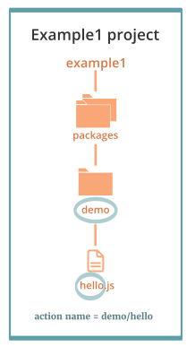
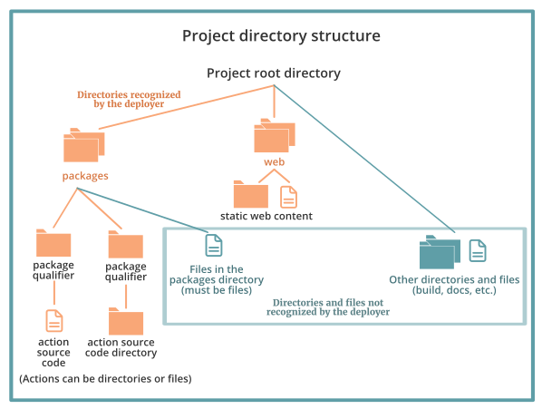
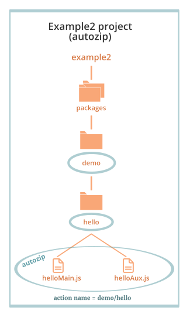
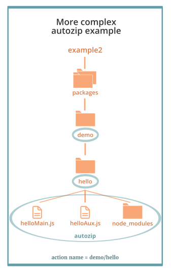
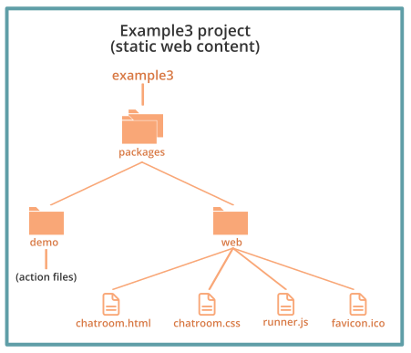

<main>
This document provides information about the Nimbella Command Line Tool, called nim, and its Command Line Interface (CLI). There are also several [Nimbella demo projects at GitHub](https://github.com/nimbella/demo-projects) that you can try out.

---

## Your Nimbella cloud account

Your Nimbella cloud account gives you the following benefits:

*   A dedicated and secure domain name for your cloud applications. If you need more, let us know.
*   Static front-end assets are automatically deployed to and served from a global CDN.
*   Back-ends you can run on demand, near-instantly. No servers for you to manage.
*   A secured data bucket to upload files. Limit access as needed.
*   Application state recorded in a [Redis key-value store](https://redis.io), with data accessible to all your back-end logic at extremely low latency.
*   Workflows you can  build and the ability to orchestrate long-running tasks.
*   CLI and workbench tools to manage Nimbella services, build projects, and deploy your apps.

Once you [create your first Nimbella Cloud namespace](#create-a-nimbella-namespace) you are ready to login and [run CLI commands](#nim-command-overview) and deploy projects to your Nimbella Cloud.

---


## Install the Nimbella Command Line Tool (nim)

In most cases, we recommend that you use nim as a command to be invoked globally from shells or scripts. Here are the advantages of shell invocation:

*   The CLI is self-contained and has no dependencies on previously installed software.
*   You get automated update services when new versions are available.

If you don’t want a global installation but rather want to make nim a dependency of some other package, _and your node version is at least 10.0_, you can install it as a dependency with npm or yarn. See the second procedure.

### Install nim globally

1. Install nim according to your operating system:
   *   On Windows, download and run [the Windows installer](https://apigcp.nimbella.io/downloads/nim/win/nim-x64.exe).
   *   On Mac, download and run [the Mac installer](https://apigcp.nimbella.io/downloads/nim/macos/nim.pkg).
   *   On Linux, run the following script:
       `curl https://apigcp.nimbella.io/downloads/nim/nim-install-linux.sh | sudo bash`
2. When the installation completes, run the following command: `nim update`

The `nim update` command verifies that nim is installed and capable of self-updating. If the initial installation happens not to be the latest version, the update step also corrects that.

### Install nim as a dependency

Use this method only to make nim a dependency of some other package. To invoke nim globally, use the previous procedure.

**Notes:**

*   When installed as a dependency, the `nim update` command will not work. You have to do a fresh install to get later versions.
*   This form of installation requires you to have `node` installed at a minimum version of 10.0.

1. Run either of the following commands, depending on whether you want to use npm or yarn:
  *   For npm: `npm install https://apigcp.nimbella.io/downloads/nim/nimbella-cli.tgz`
  *   For yarn: `yarn add https://apigcp.nimbella.io/downloads/nim/nimbella-cli.tgz`

2. When installation finishes, execute nim locally to the package into which it has been incorporated with the following command. For example using `npx nim ...`

---


## nim command overview

The Nimbella Command Line Tool (nim) is your primary portal to Nimbella services. Typing `nim` at a command prompt produces the latest version of help output, similar to the following.

```
> nim
A comprehensive CLI for the Nimbella stack

VERSION
  nimbella-cli/0.1.15 darwin-x64 node-v13.12.0

USAGE
  $ nim [COMMAND]

COMMANDS
  action      work with actions
  activation  work with activations
  auth        manage Nimbella and GitHub credentials
  doc         display the full documentation of this CLI
  help        display help for nim
  info        show information about this version of 'nim'
  key-value   work with key-value store
  namespace   work with namespaces
  objects     work with objects store
  package     work with packages
  project     manage and deploy Nimbella projects
  route       work with routes
  rule        work with rules
  trigger     work with triggers
  update      update the nim CLI
  web         work with web contents
  workbench   open Nimbella workbench with login or command
```

These commands fall into four categories, described in the following sections.

**Note:** In some of the help output from `nim` (as shown) there are colon separators between parts of the command.  This happens because nim is based on [oclif](https://github.com/oclif), the Open CLI Framework from Heroku, which requires them. However, nim has logic to allow blank separators, so you can also use these commands with blank separators, as in these examples:

```
> nim auth list
> nim project deploy
```

If you find a case in which a blank separator doesn't work in nim, please [report it as an issue](https://github.com/nimbella/nimbella-cli/issues) or use a colon separator.


### 1 Credential management to access Nimbella namespaces

The `auth` subtree lets you manage Nimbella credentials for Nimbella _namespaces_, as described in the section [Nimbella Namespaces](#nimbella-namespaces).

The `nim auth` subtree has its own set of commands, as follows.

```
> nim auth
manage Nimbella and GitHub credentials

USAGE
  $ nim auth:COMMAND

COMMANDS
  auth:current  Get current namespace with optional details
  auth:export   Make a token for switching to another machine or web browser
  auth:github   manage GitHub accounts
  auth:list     List all your Nimbella namespaces
  auth:login    Gain access to a Nimbella namespace
  auth:logout   Drop access to a Nimbella namespace
  auth:switch   Switch to a different Nimbella namespace
```


### 2 Project-level deployment commands

The `nim project` subtree has three commands:

*   `create`
*   `deploy`
*   `watch`

These subcommands operate on logical groupings of resources (web content, storage, and APIs) that make up typical applications. Such a grouping is called a _project_ and is described more in [About Nimbella Projects](#overview-of-nimbella-projects-actions-and-deployment).

The `project:deploy` command controls the Nimbella _deployer_, which operates on projects. Much of the rest of this document concerns itself with projects and the deployer.

Help output for the `nim project` command:

```
> nim project
manage and deploy Nimbella projects

USAGE
  $ nim project:COMMAND

COMMANDS
  project:create  Create a Nimbella Project
  project:deploy  Deploy Nimbella projects
  project:watch   Watch Nimbella projects, deploying incrementally on change
```

Help output for the `nim project create` command:

```
> nim project create
Create a Nimbella Project

USAGE
  $ nim project:create [PROJECT]

ARGUMENTS
  PROJECT  project path in the file system

OPTIONS
  -c, --clientCode                           Generates client code
  -i, --id=id                                API specs id/name/path
  -k, --key=key                              Key to access the source API
  -l, --language=go|js|ts|py|java|swift|php  [default: js] Language for the project (creates sample project unless source is specified)
  -o, --overwrite                            Overwrites the existing nimbella project directory if it exists
  -s, --source=postman|openapi               API specs source
  -u, --updateSource                         Sync updated API specs back to source
  -v, --verbose                              Greater detail in error messages
  --config                                   Generate template config file
  --help                                     Show help
```

See the [Example: Create and deploy a project with a single action](#example-create-and-deploy-a-project-with-a-single-action) for an example of using the project create command.

Help output for the `nim project deploy` command:

```
> nim project deploy
Deploy Nimbella projects

USAGE
  $ nim project:deploy [PROJECTS]

ARGUMENTS
  PROJECTS  one or more paths to projects

OPTIONS
  -v, --verbose          Greater detail in error messages
  --apihost=apihost      API host to use
  --auth=auth            OpenWhisk auth token to use
  --env=env              path to environment file
  --exclude=exclude      project portions to exclude
  --help                 Show help
  --include=include      project portions to include
  --incremental          Deploy only changes since last deploy
  --insecure             Ignore SSL Certificates
  --target=target        the target namespace
  --verbose-build        Display build details
  --verbose-zip          Display start/end of zipping phase for each action
  --web-local=web-local  a local directory to receive web deploy, instead of uploading
  --yarn                 Use yarn instead of npm for node builds

```

See the [Example: Create and deploy a project with a single action](#example-create-and-deploy-a-project-with-a-single-action) for an example of using the project deploy command.

Help output for the `nim project watch` command:

```
> nim project watch
Watch Nimbella projects, deploying incrementally on change

USAGE
  $ nim project:watch [PROJECTS]

ARGUMENTS
  PROJECTS  one or more paths to projects

OPTIONS
  -v, --verbose          Greater detail in error messages
  --apihost=apihost      API host to use
  --auth=auth            OpenWhisk auth token to use
  --env=env              path to environment file
  --exclude=exclude      project portions to exclude
  --help                 Show help
  --include=include      project portions to include
  --insecure             Ignore SSL Certificates
  --target=target        the target namespace
  --verbose-build        Display build details
  --verbose-zip          Display start/end of zipping phase for each action
  --web-local=web-local  a local directory to receive web deploy, instead of uploading
  --yarn                 Use yarn instead of npm for node builds
```

See [Project watching](#project-watching-for-incremental-deployment) for an example of how to use this command for incremental deployment which facilitates faster project development.

### 3 Entity management commands

The `action`, `activation`, `key-value`, `namespace`, `objects`, `package`, `route`, `rule`, `trigger`, and `web` commands each manage the corresponding type of entity in your namespace.

If you’re an [Apache OpenWhisk](https://openwhisk.apache.org) developer, see [Entity Management commands in nim vs. wsk](#entity-management-commands-in-nim-vs.-wsk) for a comparison of entity management commands.


### 4 Supporting commands

The `doc`, `help`, `info`, `update`, and `workbench` commands provide the following supporting services:

*   `doc`: Displays the documentation set for the nim CLI.
*   `help`: Displays help for nim.
*   `info`: Displays information about the version of nim that is installed.
*   `update`: Updates to the latest version of nim.
*   `workbench`: Manages the Nimbella Workbench for you.

The Nimbella Workbench is described in [The Nimbella Workbench](#the-nimbella-workbench)

**Note:** `nim update` works only when nim is installed [using the recommended installation method for use from a shell](#install-nim-for-shell-invocation-globally). It does not work when nim is installed [as a dependency using npm or yarn](#install-nim-as-a-dependency).

---

## The Nimbella workbench

Many (though not all) `nim` commands will also run in your web browser, which wraps some graphical assistance around `nim` and provides some additional commands.  This separate but closely related tool is called the Nimbella Workbench.

If you've never used the workbench (and assuming you are logged into a Nimbella account) you should enable the same Nimbella account on the workbench by opening it from the command line, as follows.

```
nim workbench login
```

This will open the workbench in your default browser and log you in there with the same Nimbella namespace credentials you are using locally (see [Nimbella Namespaces](#nimbella-namespaces)).  Those credentials will be remembered for that browser on the current machine.  You can bookmark the workbench, or you can run it again with a particular command, as in the two following examples.

```
nim workbench run
nim workbench run action list
```

Once you are in the workbench, all `nim` subcommands are available except for these few.

```
action create
action update
object create
object get
project create
project watch
web create
web get
workbench login
workbench run
```

Those few commands are either inappropriate for the workbench or require filesystem access, which is unavailable in a browser.

When running in the workbench, the `project deploy` command can only deploy from GitHub, not from the local file system.  It also cannot deploy projects that require building (forking a process and using the local file system).  A remote building option is planned for the future.

The prefix `nim` is optional in front of workbench commands.

To transfer your credentials to the workbench running in a browser that is not the default browser, just visit the workbench there and type `auth login`.  You will need to provide some of the information you provided when you opened your Nimbella account but a duplicate account will not be created.  You will be connected to your existing account.

## Nimbella namespaces

You must have permission to use a specific namespace on the Nimbella platform In order to deploy a nim project and use many other nim capabilities.  A Nimbella namespace comes with storage resources which are managed as part of the namespace.

This section contains information about how to create a Nimbella namespace, view the credential store, and perform other tasks involving namespaces.


### Create a Nimbella namespace

Here’s how to create a Nimbella workspace in `nim`.

**If you have not yet downloaded and installed the Nimbella Command Line Tool:**

Visit [nimbella.com](https://nimbella.com) and press the signup button (it's free).  Follow instructions from that point.

**If you have already downloaded and installed the Nimbella Command Line Tool:**

Issue

```
> nim auth login
```

After going through the signup process (which typically takes one or two minutes), `nim` will return having fully provisioned your account.  Occasionally, if the process takes too long, `nim` may time out and encourage you to do another `nim auth login` in a minute or two.  The second attempt should succeed quickly.

In general (e.g.) when switching to a different machine you can just issue

```
> nim auth login
```

This will connect the tool to your account (it may or may not ask for identification again, depending on whether or not your browser remembers this information).

### View the credential store

A typical namespace is provisioned with the following:

*   A web content area and an object storage area.  These are always provided as a pair and summarized as 'Storage' when presented in a list.
*   A [Redis](https://redis.io) instance for storing key-value pairs
*   A DNS domain name for web content
*   A set of OpenWhisk resources

After you’ve created a namespace, you can view it and information about it in the _credential store_.

**To view the credential store in nim:**

*   Use the `auth list` command, as follows:

```
> nim auth list
  Namespace            Current Storage   Redis Production Project
✓ <your namespace>       yes     yes      yes     no      <any>
```

As a new user, your credential store has only one entry, but, if you or your team acquires more namespaces, there can be multiple entries.
Here’s more information about the table displayed in the response:

*   The **Current** column displays `yes` for exactly one namespace.
    - The Nimbella deployer will deploy this namespace in the absence of other directives.
    - This entry is also marked by a check mark for added emphasis
*   The **Storage** column indicates whether the namespace has provision for web content storage as discussed in [Adding static web content](#adding-static-web-content). There is also a second object storage bucket available for general use, not connected to the web.
*   The **Redis** column indicates whether the namespace has a Redis key-value storage instance available for use by actions.
*   The **Production** and **Project** columns become meaningful as you begin to define Nimbella [projects](#about-projects) and wish to [tie namespaces to projects](#tieing-namespaces-to-projects).

### Create and manage multiple namespaces

There are a number of reasons why it can be useful to have multiple namespaces. For example, while multiple applications can share a namespace, there are also good reasons to isolate them.

**To create additional namespaces:**

1.  [Contact Nimbella Support](https://nimbella.com/contact).
2.  Identify yourself as an existing developer and provide the email or GitHub account you used for signing up initially.
3.  Wait for an email to arrive containing instructions for adding the additional namespace to your credential store.

**To view all of your namespaces:**

Follow the procedure to [view your credential store](#view-the-credential-store).
A newly added namespace is automatically set as current, indicated by a checkmark and a **yes** in the **Current** column.

#### Switch between namespaces

If you have more than one namespace, you can switch between them without needing to log into your account again by using the following command:

```
nim auth switch <namespace>
```

This changes the target namespace for future project deployments.  Most namespace names are long and tedious to type, so we provide an abbreviation capability.

```
nim auth switch dt-
```

will switch to a namespace uniquely identified by the characters `dt` followed by other characters.

#### Manage multiple namespaces

The easiest way to manage multiple namespaces is to maintain the rule that each namespace is tied to a project and each project is tied to one or two namespaces. To do this, add the following top-level directive to a _project.yml_ configuration file for each project:

```
targetNamespace: <namespace>
```

or

```
targetNamespace:
  test: <namespace1>
  production: <namespace2>
```

A more complete explanation of how `targetNamespace` affects project deployment is provided in [Tieing namespaces to projects](#tieing-namespaces-to-projects).

There are more complex development scenarios, in which you would not want to correlate projects and namespaces so strongly.  For those cases, we also provide the `--target` directive of the `project deploy` command:

```
nim project deploy <projectPath>... --target <namespace>
```

**Notes:**

*   If your project has a _project.yml_ configuration file with a `targetNamespace` directive and also uses the `--target` option in a `project deploy` command, the latter takes precedence.

*   For more information about using _project.yml_ files to configure more complex projects, see [Adding Project Configuration](#adding-project-configuration).

---


## Overview of Nimbella projects, actions, and deployment

A Nimbella _project_ is a logical grouping of static web content and _actions_. An action is a function or program written in a programming language supported by the Nimbella Cloud (e.g., JavaScript, TypeScript, PHP, Python, Java,  Go, or Swift). An action usually produces some output in response to an event. For example, an action can be used to convert an image to text, update a stock portfolio, or generate a QR code. Actions are usually grouped into _packages_, but you can create them without a package qualifier if you wish.

Projects are _deployed_ as a unit into your Nimbella Cloud namespace to make them visible to your end-users to the extent that you wish. Your namespace can have any number of projects that you want. An application can have any number of projects to achieve its full functionality. This modular approach also lets you share projects across apps and namespaces.

On the other hand, `nim` provides some special support for the model where namespaces are tied to specific projects, which have the sole right to deploy to them.  It is possible to tie two namespaces to each project, one for testing, one for production.  The support for this model is described in [tieing namespaces to projects](#tieing-namespaces-to-projects).

Projects can contain actions, or actions plus static web content, or actions plus web content plus build steps. The following sections show you how to go from simple to complex:

*   [Example: Create and deploy a project with a single action](#example-create-and-deploy-a-project-with-a-single-action)
*   [Add static web content](#adding-static-web-content) to a project
*   [Add build steps](#incorporating-build-steps-for-actions-and-web-content) to a project

Projects can be deployed without any configuration, but in more complex cases you can
[add a project configuration](#adding-project-configuration).

Finally, there are variations in how to [deploy projects](#about-projects), including [incremental deployment](#deploying-projects-incrementally) to reduce deployment time, especially during project development.

---


## Example: Create and deploy a project with a single action

Let’s start with a really simple example that shows the basics of creating the source code for an action, placing it in a directory structure for a project, and deploying the project. This project needs no configuration and creates actions automatically based on the project directory structure.

In the simplest implementation of a project, each action corresponds to a single source file. In this example:

*   A `Hello World` print function is placed in a file named _hello.js_.
*   A project named `example1` is created and deployed to your namespace.

**To create and deploy a project to print Hello World (simplest form):**

```
> nim project create example1
> nim project deploy example1
Deploying project '/path/to/example1'
  to namespace '...'
  on host 'https://...nimbella.io'
Deployment status recorded in 'example1/.nimbella'

Deployed actions:
  - hello
> nim action invoke hello
{
  "greeting": "Hello stranger!"
}
```
So, what just happened?  As a result, of `nim project create`, `nim` generated a project and added a sample to it called `hello.js`.  Specifically, in your current directory, it created

```
example1/packages/default/hello.js
example1/web
```

We address the purpose of the `web` directory in [Adding static web content](#adding-static-web-content) and the `packages` directory later in this section.

As a result of `nim project deploy`, the project was deployed to your namespace and the result was an action called `hello`.  To record the status of that deployment, `nim` created

```
example1/.nimbella/...
```

The `nim action invoke` step invoked the just-deployed action.

THe `nim project create` command has some other features that will come up in other examples.  But, `nim project create` is only a convenience.

To make the process less magical and more hands-on, remove the entire `example1` from your local filesystem and let's start over, without using `nim project create`, emphasizing that a Nimbella project, no matter how it is created and modified, is just an area in your local file system.

**Create and deploy a project to print Hello World (more manually):**

(1) Create _hello.js_ with the following code:

```nodejs
function main(args) { return { msg: 'Hello World' } }
```

(2) Create a project directory with the following command:

```
> mkdir -p example1/packages/demo
```

The [project directory structure](#about-projects) sets the name of the project (`example1`), a _packages_ directory, and the package qualifier (`demo`).  There is no `web` directory this time; `web` is not required if you aren't adding web content.

(3) Copy the JavaScript file into the `demo` directory with the following command.

```
> cp hello.js example1/packages/demo
```

(4) Deploy the project.

```
> nim project deploy example1
Deploying project '/path/to/example1'
  to namespace '...'
  on host 'https://...nimbella.io'

Deployed actions:
  - demo/hello
```

(5)  Invoke the deployed action.

```
> nim action invoke demo/hello
{
  "msg": "Hello World"
}
```

Here’s a diagram of the project structure that was created in this procedure.

<center id="fig2"></center>
<center>**Figure 1: Directory structure of the example1 project**</center>

**Notes:**

*   The `project deploy` command activates the deployer, which names the action automatically based on the source code file (`hello`), prepended by the package qualifier (`demo`).
*   If you want an action to have a simple name (no package qualification), put it in a package directory called _default_. In that case, no package qualifier is prepended. See [Project Directory Structure](#project-directory-structure).  When `nim` generates a sample in `nim project create` it uses this feature.
*   The correct runtime for the source code file is determined according to the file suffix.  The command `nim info --runtimes` will list the supported runtimes.  At this time, the list does not include file suffixes.  See [Nimbella Deployer Supported Runtimes for Actions](#nimbella-deployer-supported-runtimes-for-actions) for a list that includes suffixes.
*   Project configuration occurs automatically when it can, but see [Adding Project Configuration](#adding-project-configuration) for complex projects.

**Next steps:**

*   To add web content to your project, see [Adding static web content](#adding-static-web-content).
*   If you need to add build steps, see [Incorporating build steps for actions and web content](#incorporating-build-steps-for-actions-and-web-content).
*   Read more about [deploying projects](#about-the-nimbella-deployer).
*   Look at a somewhat more complex [example QR code project with both an action and static web content](https://github.com/nimbella/demo-projects/tree/master/qrcode).

---


## About projects

A project represents a logical unit of functionality whose boundaries are up to you. Your app can contain one or more projects. The directory structure of a project triggers how the deployer finds and labels packages and actions, how it deploys static web content, and what it ignores. In more complex cases you can set more control over project deployment by adding a [project configuration](#adding-project-configuration).


### Project directory structure

A project has a fixed directory structure, which determines how projects are deployed. Here’s a diagram that summarizes the directory structure of an individual project with no project configuration, with explanation below.

<center></center>
<center>**Figure 2: Basic directory structure of a project**</b></center>

The project has a root directory, within which a certain small number of directory names are significant to the deployer, specifically:

*   A _packages_ directory. Each subdirectory of _packages_ is treated as a package and is assumed to contain actions, in the form of either files or directories. Files in the _packages_ directory are ignored by the deployer.
*   A _web_ directory, which contains directories and files with static web content.

Anything else in the root directory is ignored by the deployer, shown in blue in the diagram. This lets you store things in the root directory that need to be “off to the side,” such as build directories used by the deployer and project documentation.


### Projects with multiple actions

Adding more actions to a project is easy when each action is related to a single source code file. You can create as many subdirectories of the packages directory as you want and add as many source code files as you want to each subdirectory. (See [Project Directory Structure](#about-projects).)

### Factors in choosing project size

There is no limit on how many packages and actions can be in a project.  However, using fewer very large projects or many small projects both have some negative ramifications, which are solved by using [incremental deployment](#deploying-projects-incrementally).

For example, you could create one large project. However, the default behavior of the deployer is to deploy everything in the project that it can, so deployment could become time-consuming.

The other extreme is to create many small projects. You can use the `project deploy` command with a list of projects in a single invocation to deploy them all at once (e.g., `nim project deploy example1 example2 …`). Having lots of small projects may lengthen the build process, especially during iterative development.

Incremental deployment facilitates deployment of both large and small projects, so you can create projects that make sense logically.


### Factors in choosing project boundaries

Projects and actions are very flexible.

*   When deploying a project, all of its actions and web resources are installed into a single target namespace.
*   Multiple projects can deploy into the same namespace.
*   The actions within a project can span multiple packages and a given package can have actions contributed by multiple projects.

In other words, _you_ decide on project boundaries based on deployment convenience.

**Note:** As a consequence of this flexibility, it’s important to watch for possible collisions between different projects trying to install the same resource. There are some audit trails that can help, described in [Deployer recordkeeping](#deployer-recordkeeping).

---


## About actions

### Actions Have Public URLs by Default Unless the Project is Configured

Every action produced by a no-configuration project such as [the example project above](#example-create-and-deploy-a-project-with-a-single-action) is publicly accessible via a URL and is called a _web action_. You can retrieve the URL for any particular web action by using the `action get` command, as in the following example, which returns the URL for the `demo/hello` action created in the previous example.

```
> nim action get demo/hello --url
https://....nimbella.io/api/v1/web/.../demo/hello
```

If you don’t want your actions to be publicly accessible through an unprotected URL, you’ll need to [add a project configuration](#adding-project-configuration).


### Using zipped source files to form a single action

If you have more than one source file that must be bundled together to create a single action, you can zip the source files together as long as the file name and suffix take the following form _\<xxx\>.\<runtime\>.zip_.

The deployer normally [determines the runtime for the source file from the file’s suffix](#nimbella-deployer-supported-runtimes-for-actions), and the _.zip_ suffix doesn’t provide this information, so the runtime must be specified between the file name and the file suffix, demarcated by periods. For example, the name _hello.nodejs.zip_ can be used for a zipped action whose action name is `hello` and whose runtime kind is the default version of Node.js.

If you want to force a specific runtime version, use a file of this form instead: _hello.nodejs-8.zip_. The Nimbella Cloud must support the version you specify.

Some language runtimes, such as Java, also accept specialized archives such as _.jar_ files, or they directly accept binary executables. In this case, the runtime is determined by the file extension in the normal manner, such as _hello.jar_. Other cases are not specially handled by nim and might require [adding a project configuration](#adding-project-configuration).

Zipped actions are usually created in a separate build step. As an alternative, Nimbella has [an autozip feature triggered by directory structure](#multifile-actions-created-with-autozip).


### Multifile actions created with autozip

By creating a directory under the package directory, named for the action, and containing its source file(s), you can expand to multiple source files and they will be zipped automatically. Certain conditions must be met for this to work. Suppose the [example1 project](#example-create-and-deploy-a-project-with-a-single-action) has a `hello` action with two source files: _helloMain.js_ and _helloAux.js_. To create the `demo/hello` action, add a `hello` directory as a child of the `demo` directory, as shown in this diagram.

<center></center>
<center>**Figure 3: Two source files in an action directory for automatic zipping**</center>

The difference from the [example1 directory structure](#fig2) is that the `hello` action is a _directory_ rather than a single source file. The source files in the directory are zipped automatically to form the action.

For autozipping to work in a project with no configuration, the following conditions must be met:

*   At least one source file must have [a suffix from which the runtime type can be inferred](#nimbella-deployer-supported-runtimes-for-actions).
*   No other source file can have a suffix implying a different runtime.
*   All source files must be compatible with the chosen runtime.
*   Exactly one file must contain an identifiable `main` entry point, as required by the particular runtime selected.

These conditions can be relaxed by using [project configuration](#adding-project-configuration).

Subdirectories can be present under an action directory (for example, a `node_modules` directory as in the following diagram). These directories are zipped up with everything else under the action directory.

<center></center>
<center>**Figure 4: Autozipping a subdirectory of an action directory**</center>

You can optionally limit the files to be zipped in either of two ways:

*   Add a file called `.include`, which lists exactly the items to be included. Anything else in the action directory is excluded. Wildcards are not permitted in this file but entries can denote directories as well as files. The `.include` file can also be used for linking to somewhere else in the filesystem, as described in [Using an action source from elsewhere in the filesystem](#using-an-action-source-file-from-elsewhere-in-the-filesystem).
*   Add a file called `.ignore`, stating which files and directories _not_ to include. The `.ignore` file follows the same rules as `.gitignore` and has the same effect. It is not necessary to list `.ignore` inside itself. It is automatically ignored, as are certain build-related files.

You cannot have both a `.include` and `.ignore` in the same action directory.

**Note:** No zipping occurs in any of the following cases:

*   The directory representing the action contains only a single file.
*   Only one file is listed in `.include`.
*   Only one file is left after applying the rules in `.ignore`.


#### Using an action source file from elsewhere in the filesystem

If you use an `.include` file, it can contain entries that denote files or directories outside the action directory. Entries can be either absolute paths or paths that are relative to the action directory using standard `../` notation.

**Note:** Although paths in `.include` can terminate outside the project, it becomes harder to relocate the project. It’s better practice to include files within the project. If they are directories that you want the deployer to ignore, you can put them in the root directory, as described in [About projects](#about-projects).

Entries in `.include` are interpreted differently if they are absolute or relative. If the path is relative, the resulting entries in the zip file start with the last segment of the listed path. Here are two examples:

*   If you have `../../../lib/node_modules`, the contents of the node_modules directory are zipped but files inside the directory have the form `node_modules/<path>`.
*   If you have `../../../lib/helpers.js` the file becomes just `helpers.js`.

---


## Adding static web content

To add static web content to a project, add a directory called _web_ as a peer of the directory called _packages_. This directory should contain files whose suffixes imply well-known mime types for web content, such as _.html_, _.css_, or _.js_.

**Note:** JavaScript files in static web content are _not_ actions but are scripts intended to run in the browser.

The _web_ directory can have subdirectories and can be built by website builders or other tools.

Like an action directory, the _web_ directory may contain `.include` or `.ignore` to control what is actually considered web content, as opposed to build support or intermediate results. For more information about `.include` and `.ignore`, see [Multifile actions created with autozip](#multifile-actions-created-with-autozip).

The _web_ directory also supports integrated [building](#incorporating-build-steps-for-actions-and-web-content), just like an action directory.

Here’s an example of a project with modest web content, populated by hand. For simplicity, the actions of the project are not shown.

```
example3/web/chatroom.html
example3/web/chatroom.css
example3/web/runner.js
example3/web/favicon.ico
```

Here’s a diagram of the `example3` project structure.

<center></center>
<center>**Figure 5: A project with static web content**</center>

Here’s the output when the project is deployed.

```
> nim project deploy example3
Deploying project '/path/to/example3'
  to namespace '...'
  on host 'https://...nimbella.io'

Deployed 4 web content items to
  https://<namespace>-host.nimbella.io
Deployed actions:
  ...
```

As the output shows, the contents of the web directory were deployed to the web, with URLs within your namespace’s unique DNS domain `<namespace>-host.nimbella.io`, where `<namespace>` is your namespace. The remaining portion of the domain name may differ depending your account configuration and your API host within the Nimbella Cloud. To access the content, either `http` or `https` may be used. For `https`, the SSL certificate will be that of Nimbella Corp.

**Notes:**

*   For a web deployment to work correctly, the namespace entry in the credential store must include storage. See [View the Credential Store](#view-the-credential-store) to generate the credential store, then check to make sure the `Storage` column of the response says `yes`. The first namespace created for each user includes storage, but it’s possible to create namespaces without it.
*   You can add [project configuration to change how your static web content is deployed](#project-configuration-for-web-content).
See [an example of how to configure a project when you generate web content with a tool such as React.](#configuration-example-for-web-content-generated-by-a-tool)

---


## About the Nimbella deployer


### Nimbella deployer supported runtimes for actions


The Nimbella deployer determines the kind of runtime required for the action from the file suffix. The following runtimes are supported:

*   Node.js for suffix _.js_
*   Typescript for suffix _.ts_
*   Python for suffix _.py_
*   Java for suffixes _.java_ and _.jar_
*   Swift suffix _.swift_
*   PHP for suffix _.php_
*   Go for suffix _.go_

### Deploying projects incrementally

Instead of deploying your entire project each time you make a change to the file contents, you can use incremental deployment to detect and deploy changes in the following:

*   Project structure
*   Project content
*   [Project configuration](#adding-project-configuration) (if you have created one)

This is a great time-saver during project development and also helps [facilitate deployment when your project is large](#factors-in-choosing-project-size).

Consider the following example of an `example4` project. The output from standard deployment is shown here:


```
> nim project deploy example4
Deploying project '/path/to/example4'
  to namespace '...'
  on host 'https://...nimbella.io'
Deployed actions:
  - admin/adduser
  - welcome
  - demo/hello
```

Now suppose that you’ve made changes to `demo/hello` and `welcome` but not the others. You aren’t ready to do a production deployment or submit for testing, you just want to deploy what’s changed so you can continue developing.

To deploy incrementally, use the `--incremental` flag, as in the following example.


```
> nim project deploy example4 --incremental
Deploying project '/path/to/example4'
  to namespace '...'
  on host 'https://...nimbella.io'
Deployed actions:
  - welcome
  - demo/hello
Skipped 1 unchanged action
```

Changes to actions and web content are tracked by means of digests created by the deployer and described in more detail in [Deployer recordkeeping](#deployer-recordkeeping). The deployer skips the uploads of actions and web content whose digests have not changed. Digests are computed over an action’s contents and also its metadata, so if you use a [project configuration](#adding-project-configuration) file to change the properties of an action, those changes are detected as well.

The `--incremental` option also skips rezipping large multi-file actions whose included contents are older than the last zip file.

The `--incremental` option is accurate in determining what has changed unless you add build steps. After you add build steps, some heuristics come into play, as discussed in [Build States and the Effect of --incremental on Builds](#build-states-and-the-effect-of-incremental-on-builds).


#### Project watching for incremental deployment

A good way to implement incremental deployment during project development is to use `nim project watch`. The `project watch` command typically runs until interrupted in a devoted terminal window so you can work elsewhere, such as in your favorite IDE.

Here’s an example of using this command for incremental deployment.

```
> nim project watch example4
Watching 'example4' [use Control-C to terminate]
...
Deploying 'example4' due to change in 'path/to/packages/demo/hello'

Skipped 4 unchanged web resources on
  https://<namespace>-host.nimbella.io
Deployed actions:
  - demo/hello
Deployment complete.  Resuming watch.
```

The `project watch` command accepts a list of projects and most of the flags that project `deploy` accepts, as described in [Project-Level Deployment Commands](#project-level-deployment-commands). An exception is `--incremental`, which is assumed.

### Deploying Portions of Projects Selectively

There may be occasions when you only want to deploy parts of a project.  If the change-based selection of incremental deployment does not fit your needs, you can control which actions are deployed (and whether web content is deployed) directly from the command line.

```
# Deploy just the web content and no packages
nim project deploy printer --include web

# Deploy everything except the admin package
nim project deploy printer --exclude admin

# You can use --include and --exclude together
nim project deploy printer --include admin,printer --exclude printer/notify
```

The general rule for both `--include` and `--exclude` is a comma-separated list of tokens (no whitespace).  The tokens may be

- the special word `web` referring to the web content of the project
- the name of a package
  - if the package is called `web`, you should remove ambiguity by using a trailing slash as in `web/` (a trailing slash is accepted on any package)
  - the package name `default` is used for the actions that are not members of any package
- a qualified action name in the form `package-name/action-name`
  -  e.g. `printer/notify` or `default/hello`
  -  the `default/` prefix is required for actions not in any package; otherwise, the name will be taken to be a package name
- wildcards are _not_ supported

If you specify only `--include`, then only the listed project portions are deployed.  If you specify only `--exclude`, then _all but_ the listed project portions are deployed.  If you specify both flags, the deployer first includes only what is listed in `--include` and then excludes from that list.  This allows you to include a package while excluding one or more of its actions.

### Deploying Directly from GitHub

If you have Nimbella projects in a GitHub repository, you can deploy directly from GitHub without the need to create a local clone.  If you do have a local clone, you can deploy as needed from the clone or directly from GitHub.  For example, deploy from the clone to include your local modifications.  Deploy from GitHub to ignore your local modifications and restore the deployed code to what is in the remote repository.

The `nim` command does not get involved in keeping your clone in synch with the repository; that is up to you as a developer.

To indicate you want to deploy from GitHub, use a project path that starts with one of the following.

```
github:
git@github.com:
https://github.com/
```

The deployer supports all three prefix styles to align with developer habits and URLs copied from elsewhere: all three are equivalent and authenticate to GitHub in exactly the same way.

You follow the prefix with the "owner" (GitHub account), repository, path to the project within the repository (if any), and specific branch or commit (if not `master`).   For example,

```
nim project deploy github:nimbella/demo-projects/visits
nim project deploy git@github.com:/my-account/my-repo-with-project/#dev
```

The deployer does not use SSL public/private keys or username/password authentication.  It relies on tokens issued for you by GitHub.  If you obtained your Nimbella account using your GitHub account for identification, there is _probably_ already a GitHub token stored as part of your Nimbella credentials (this depends on the details of account provisioning).

You can check GitHub accounts for which you have tokens in your Nimbella credential store by issuing

```
nim auth github --list
```
